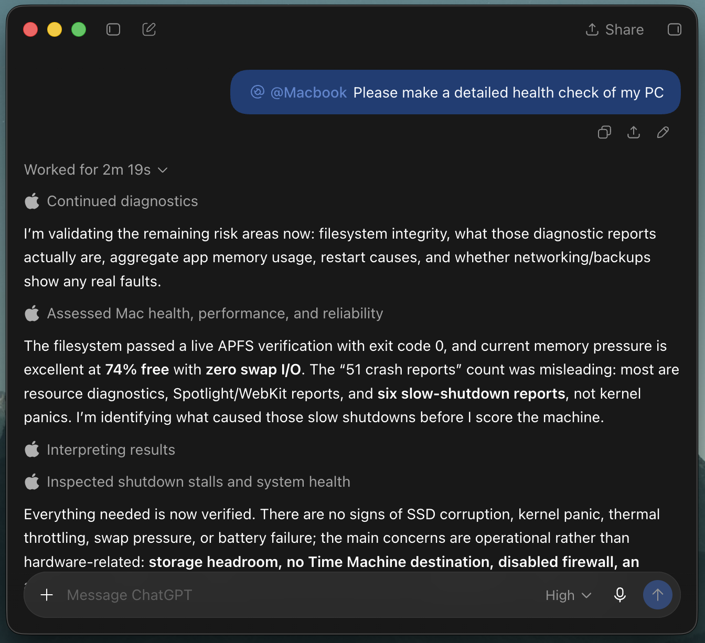
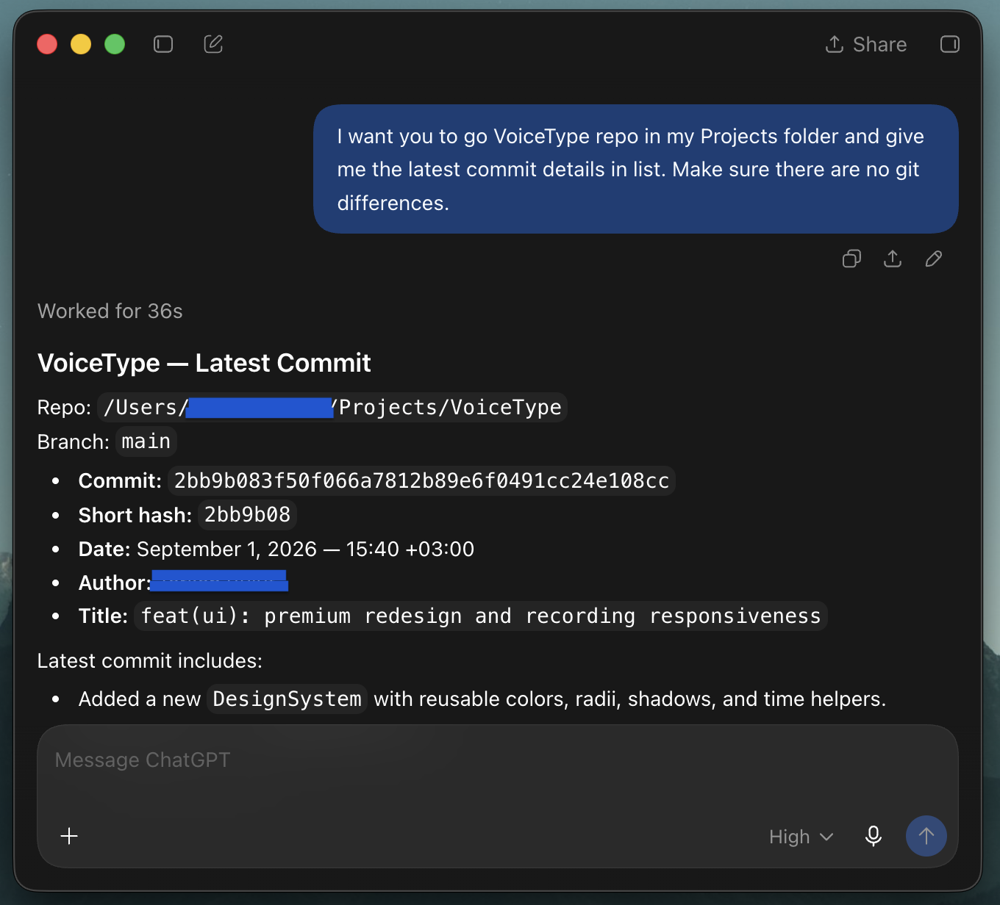

# Mac MCP

## Screenshots

<p align="center">
  
  
</p>

Mac MCP is a local macOS control server for AI agents. It exposes the same Mac through a native MCP endpoint and a REST/OpenAPI surface for clients such as Custom GPT Actions.

Version 1.1 includes 57 MCP tools covering shell execution, files, processes, background jobs, macOS automation, browser control, screenshots, HTTP requests, search, interactive questions, and a new unified macOS UI observation/action layer.

> **Security:** Mac MCP can execute shell commands, read and modify files, and control your desktop. Keep authentication enabled whenever the server is reachable outside localhost. Use a strong `MCP_API_KEY`, keep `MCP_ALLOW_NO_AUTH=false`, and only expose the server to clients you trust.

## What's new in v1.1

- `mac_observe`: reads the frontmost or named app through macOS Accessibility, returns stable `element_id` values, window metadata, UI roles/values/actions, and optionally a screenshot.
- `mac_act`: performs bounded UI action batches using the latest observation, including click, double-click, scroll, type, paste, keys/shortcuts, drag, and Accessibility/menu actions.
- Observation IDs expire and can be passed to `mac_act` to reduce stale-target mistakes.
- Potentially consequential UI clicks are gated behind `allow_risky=true`.
- Optional OCR is available when Accessibility text is insufficient.
- UI screenshots are returned as connector-safe JPEG image content (max 1600 px and 600 KB); if capture/compression cannot stay within the limit, the text observation still returns with a diagnostic instead of blocking the MCP response.
- Shell, AppleScript, browser automation, and interactive dialogs now terminate their process groups on timeout instead of leaving descendants behind.
- Background jobs have bounded waits, cleaner stalled/timeout states, reliable process-group termination, and a 60-second default timeout when none is supplied.

The new `mac_observe` and `mac_act` tools are currently exposed through the MCP endpoint. The Custom GPT REST/OpenAPI surface remains the existing 17 REST operations.

## Tool coverage

| Area | MCP tools | Highlights |
| --- | ---: | --- |
| Terminal & system | 4 | shell commands, process list/kill, system info |
| Background jobs | 7 | start/status/output/stop/list/wait/parallel |
| Files | 13 | read/write/edit/copy/move/delete/tree/search-by-name |
| macOS | 12 | AppleScript, apps, clipboard, notifications, reminders, screenshots, volume/brightness |
| Unified UI | 2 | `mac_observe`, `mac_act` |
| Search | 2 | recursive grep, Spotlight |
| HTTP | 1 | outbound HTTP requests with validation |
| Browser | 15 | tabs, JS, selectors, HTML, downloads, screenshots, scrolling, keys, coordinate clicks, DOM snapshot |
| Interactive | 1 | native macOS question/answer dialog |
| **Total** | **57** | |

## Requirements

- macOS
- Python 3.10+
- Git
- ngrok account only if you want a public HTTPS URL for Custom GPT Actions

Install the core tools:

```bash
brew install python git ngrok
```

Optional helpers:

```bash
brew install cliclick      # coordinate mouse actions / typing fallback for mac_act
brew install tesseract     # OCR for mac_observe(..., ocr=true)
brew install brightness    # set_brightness
```

### macOS permissions

For full desktop control, grant the process that runs Mac MCP the permissions needed by the tools you use:

- **Accessibility**: required for `mac_observe`, `mac_act`, System Events UI automation, and some keyboard/mouse actions.
- **Screen Recording**: required when `mac_observe` includes screenshots or when screenshot tools capture protected screen content.
- **Automation**: macOS may prompt when Terminal/Python controls Safari, Chrome, System Events, Reminders, or other apps.

If browser JavaScript tools fail, enable the browser's **Allow JavaScript from Apple Events** developer setting where applicable.

## Installation

```bash
git clone https://github.com/bulutarkan/mac-mcp.git
cd mac-mcp
python3 -m venv .venv
source .venv/bin/activate
pip install -e .
cp mcp_server/.env.example mcp_server/.env
```

Edit `mcp_server/.env`:

```env
MCP_API_KEY=replace-with-a-long-random-token
MCP_ALLOW_NO_AUTH=false
MCP_ALLOW_SHELL=true
RATE_LIMIT_PER_MINUTE=120

# Optional. Defaults to your macOS home directory.
# MAC_MCP_HOME=~/Projects
# WORKDIR=~/Projects

# Paste only the static ngrok domain, without https://
NGROK_DOMAIN=your-domain.ngrok-free.dev
```

Generate a strong token with:

```bash
python3 - <<'PY'
import secrets
print(secrets.token_urlsafe(48))
PY
```

## Start, stop, restart, and status

After `pip install -e .`, the `mac-mcp` command is available inside the virtual environment:

```bash
mac-mcp start          # local server only
mac-mcp start --ngrok  # local server + managed ngrok tunnel
mac-mcp status
mac-mcp restart --ngrok
mac-mcp stop
```

Useful options:

```bash
mac-mcp start --host 127.0.0.1 --port 8000
mac-mcp start --ngrok --ngrok-domain your-domain.ngrok-free.dev
mac-mcp start --reload
mac-mcp stop --force
```

Logs are written to:

```text
~/.mac-mcp/mac-mcp.log
```

You can also run the app directly:

```bash
uvicorn mcp_server.main:app --host 127.0.0.1 --port 8000
```

## Endpoints

Local endpoints:

```text
MCP:    http://127.0.0.1:8000/mcp
REST:   http://127.0.0.1:8000/api/*
Health: http://127.0.0.1:8000/health
```

MCP clients that support Streamable HTTP can connect directly to `/mcp` and use all 57 tools.

Example REST request:

```bash
curl -X POST http://127.0.0.1:8000/api/system_info \
  -H "Authorization: Bearer $MCP_API_KEY" \
  -H "Content-Type: application/json" \
  -d '{}'
```

Example shell request:

```bash
curl -X POST http://127.0.0.1:8000/api/run \
  -H "Authorization: Bearer $MCP_API_KEY" \
  -H "Content-Type: application/json" \
  -d '{"command":"pwd && sw_vers","timeout_s":10}'
```

## Unified macOS UI tools

`mac_observe` is designed to be the first step for desktop UI work. It returns an `observation_id` and Accessibility nodes such as:

```text
w1/2/1
```

Each node can include role, title, value, enabled state, screen position, and supported Accessibility actions.

Typical flow:

1. Call `mac_observe` for the frontmost app or a named app.
2. Find the desired node and keep the returned `observation_id`.
3. Call `mac_act` with one or more actions targeting those `element_id` values.
4. Leave `return_state=true` to receive a fresh observation after the action batch.

Example action payload conceptually:

```json
{
  "observation_id": "obs_...",
  "actions": [
    {"type": "click", "element_id": "w1/2/1"},
    {"type": "type", "element_id": "w1/3", "text": "Hello", "clear": true},
    {"type": "key", "key": "return"}
  ]
}
```

Use `ocr=true` only when the Accessibility tree does not provide enough text. OCR requires `tesseract` and is slower than Accessibility inspection.

## Background jobs

Use background jobs for commands that should not block the current MCP request. Version 1.1 defaults background job execution/wait timeouts to 60 seconds; pass `timeout_s` explicitly for longer tasks, up to 600 seconds.

```text
start_background_job -> job_id
get_job_status        -> current state
get_job_output        -> stdout/stderr
wait_jobs             -> bounded wait
stop_job              -> terminate process group
run_commands_parallel -> parallel jobs + bounded collection
```

A `no_output_timeout_s` can be used to stop commands that stop producing output; these jobs end in the `stalled` state.

## Custom GPT Actions

Custom GPT Actions use the included schema:

```text
openapi/custom-gpt-actions.json
```

The schema exposes 17 REST operations:

```text
POST /api/run                 -> run_command
POST /api/system_info         -> get_system_info
POST /api/process_list        -> process_list
POST /api/kill_process        -> kill_process
POST /api/jobs/start          -> start_background_job
POST /api/jobs/status         -> get_job_status
POST /api/jobs/output         -> get_job_output
POST /api/jobs/stop           -> stop_job
POST /api/jobs/list           -> list_jobs
POST /api/jobs/wait           -> wait_jobs
POST /api/run_parallel        -> run_commands_parallel
POST /api/files               -> files_operation
POST /api/macos               -> macos_operation
POST /api/browser             -> browser_operation
POST /api/search              -> search_operation
POST /api/http                -> http_request
POST /api/interactive         -> ask_user
```

Before importing the schema, replace its placeholder server URL with your static ngrok domain.

### Static ngrok domain

Authenticate ngrok once:

```bash
ngrok config add-authtoken YOUR_NGROK_AUTHTOKEN
```

Create a static dev domain in the ngrok dashboard, then set it in `mcp_server/.env`:

```env
NGROK_DOMAIN=your-domain.ngrok-free.dev
```

Start both services:

```bash
mac-mcp start --ngrok
```

Your public endpoints will then be available under:

```text
https://your-domain.ngrok-free.dev/mcp
https://your-domain.ngrok-free.dev/api/*
```

Use the same bearer token for MCP and REST when authentication is enabled.

## Configuration

The most important environment variables are documented in `mcp_server/.env.example`:

```text
MCP_API_KEY
MCP_ALLOW_NO_AUTH
MCP_ALLOW_SHELL
MAC_MCP_HOME
WORKDIR
RATE_LIMIT_PER_MINUTE
DEFAULT_COMMAND_TIMEOUT_S
MAX_COMMAND_TIMEOUT_S
MAX_OUTPUT_CHARS
HTTP_ALLOWLIST
HTTP_HTTPS_ONLY
HTTP_MAX_RESPONSE_BYTES
HTTP_TIMEOUT_S
NGROK_DOMAIN
BROWSER_ALLOWLIST
BROWSER_HTTPS_ONLY
DOWNLOAD_DIR
MAX_JS_RESULT_CHARS
MAX_HTML_CHARS
MAX_WAIT_S
```

`MAC_MCP_HOME` controls how relative file/search paths resolve. `WORKDIR` controls the default working directory for shell/background-job execution.

## Security recommendations

- Keep `MCP_ALLOW_NO_AUTH=false` whenever the server is exposed through ngrok or another network tunnel.
- Use a long random bearer token and never commit `mcp_server/.env`.
- Bind locally to `127.0.0.1` unless you intentionally need LAN access.
- Review every tool you expose to an AI client. Shell, file, browser, AppleScript, and UI-action tools are powerful.
- `mac_act` treats likely consequential clicks as risky and requires `allow_risky=true`, but this is an additional guardrail rather than a replacement for client-side confirmation policies.
- Do not commit logs, job outputs, generated screenshots, or personal files.
- Stop the server and managed tunnel when they are not needed:

```bash
mac-mcp stop
```

## Repository structure

```text
mcp_server/
  main.py                 FastAPI + MCP app and tool registration
  cli.py                  mac-mcp start/stop/restart/status CLI
  security.py             auth, rate limiting, path/URL validation, settings
  rest_routes.py          REST API used by Custom GPT Actions
  tools_terminal.py       shell/process/system tools
  tools_jobs.py           background jobs and parallel commands
  tools_files.py          file operations
  tools_macos.py          AppleScript and macOS utilities
  tools_ui.py             Accessibility/screenshot based UI observation + actions
  tools_browser.py        Safari/Chrome automation
  tools_search.py         grep/Spotlight search
  tools_http.py           outbound HTTP
  tools_interactive.py    native user question dialog
openapi/custom-gpt-actions.json
assets/screenshots/
pyproject.toml
README.md
```

## License

MIT
