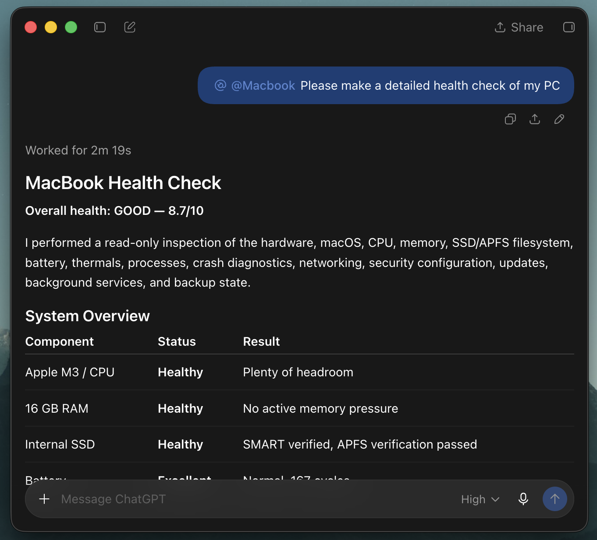

# Mac MCP

## Screenshots

<p align="center">
  
  
  
</p>

Mac MCP is a local macOS control server for AI agents. It exposes the same Mac through a native MCP endpoint and a REST/OpenAPI surface for clients such as Custom GPT Actions.

Version 1.6.4 includes 80 MCP tools covering shell execution, files, processes, background jobs, delegated OpenCode/Codex agents, macOS automation, background-first browser control with stable tab handles, persistent AI memory, reusable Agent Skills, self-updates, screenshots, HTTP requests, search, interactive questions/choices/confirmations, and a unified macOS UI observation/action layer.

> **Security:** Mac MCP can execute shell commands, read and modify files, and control your desktop. Keep authentication enabled whenever the server is reachable outside localhost. Use a strong `MCP_API_KEY`, keep `MCP_ALLOW_NO_AUTH=false`, and only expose the server to clients you trust.

## What's new in v1.6.4

- Browser tabs now have stable `tab_handle` identifiers. Chrome handles are backed by Chrome's native tab ID; Safari uses a Mac MCP registry keyed primarily by the tab's WebContent PID, so user-created/reordered tabs no longer invalidate agent targets.
- `browser_open_url` opens new tabs in the background by default and returns the new `tab_handle`; it no longer activates Safari/Chrome or switches the current tab unless `background=false` is explicitly requested.
- `browser_observe`, `browser_find`, `browser_act`, `browser_execute_js`, selector/type/wait/get-html/scroll/snapshot tools accept `tab_handle` while preserving `window_index` / `tab_index` for backwards compatibility.
- DOM-based click/type/select/scroll/wait flows remain background-safe. Native keyboard actions now return `foreground_required` unless `allow_foreground=true`; coordinate clicks and explicit tab activation remain foreground-only fallbacks.
- Native browser screenshots no longer activate the browser first. They warn that an obscured window may not yield reliable pixels and recommend DOM/protocol-level observation when possible.
- Live Safari validation kept the user's active fourth tab unchanged while two background test tabs were opened and manipulated. After closing the first test tab, the second shifted from index 6 to 5 while its handle stayed stable and its DOM state remained intact.

Previous v1.6.3 additions (Agent Skills and shared embeddings) remain unchanged.

- Added five MCP-native Agent Skills tools: `skill_list`, `skill_search`, `skill_get`, `skill_register`, and `skill_update_index`.
- Added open `SKILL.md` support with YAML `name`/`description`, managed skills under `~/.mac-mcp/skills`, optional `scripts/`, `references/`, `assets/`, external skill registration, and progressive disclosure.
- `memory_search` and `skill_search` now share one on-demand FastEmbed/MiniLM worker, model cache, and idle timer instead of creating separate model processes.
- Preserved the Mac-specific semantic fallback chain: multilingual MiniLM → Apple NaturalLanguage → dependency-free feature hash.
- Added shared embedding environment names (`MAC_MCP_EMBEDDING*`) while keeping existing `MAC_MCP_MEMORY_*` embedding variables as backward-compatible aliases.
- MCP tool count is now 80; the legacy REST/OpenAPI surface remains stable for backwards compatibility.

## Benefits and usage strategy: ChatGPT Chat vs ChatGPT Work vs Codex

Mac MCP can be used from ordinary ChatGPT conversations, ChatGPT Work, and Codex. The connector and the MCP tools are the same; the useful surface depends on whether the task is primarily conversation, workspace work, or repository implementation.

### Why ChatGPT Chat becomes especially powerful with Mac MCP

**ChatGPT Chat + Mac MCP is not limited to ordinary question-and-answer use.** Once the connector is enabled, **ChatGPT Chat can act as a long-working, coding-capable, agentic workspace for the Mac**: it can plan a task, inspect the Accessibility tree with `mac_observe`, operate applications with `mac_act`, read and modify project files, run commands, start bounded background jobs, and inspect the results in the same conversation. This makes **long-working tasks, coding workflows, research, troubleshooting, and desktop automation** available from one natural-language interface.

The key benefit is the combination of **ChatGPT Chat's reasoning and conversation flow** with **Mac MCP's local execution layer**. The MCP server supplies the Mac-side capabilities; the ChatGPT surface supplies the planning, iteration, and explanation. Use the smallest safe tool call for each step and keep the server's authentication and tunnel private.

| Surface | Best for | Benefit with Mac MCP | Official usage picture |
| --- | --- | --- | --- |
| **ChatGPT Chat** (cloud chat) | Conversational planning, explanations, research, summaries | **With Mac MCP, we turn this conversational surface into an agentic workspace for long-working tasks, coding, research, troubleshooting, and desktop automation: inspect, act, run bounded jobs, edit files, test, and iterate in one thread.** | OpenAI says cloud chats on ChatGPT plans use GPT-5.6 Sol and may use more allowance than local messages. Local messages and cloud chats share a five-hour window; additional weekly limits may apply. |
| **ChatGPT Work** | Workspace conversations, longer knowledge-work tasks, and collaboration | Useful when the Mac action is part of a broader workspace task | Work and Codex share the same pricing, credits, and usage limits. Work should not be treated as a separately documented unlimited pool. |
| **Codex** (local, CLI/IDE, or cloud) | Repository changes, coding, tests, and repeatable engineering workflows | Best fit for making and verifying code changes while Mac MCP handles local UI or system actions | For ChatGPT Plus, OpenAI publishes approximate local-message ranges per five-hour window: Sol **10–100**, Terra **25–200**, and Luna **250–2,000**. These are estimates, not guaranteed caps. |

Official references: [Models](https://learn.chatgpt.com/docs/models) and [Pricing, credits, and usage limits](https://learn.chatgpt.com/docs/pricing).

## Tool coverage

| Area | MCP tools | Highlights |
| --- | ---: | --- |
| Terminal & system | 4 | shell commands, process list/kill, system info |
| Background jobs | 7 | start/status/output/stop/list/wait/parallel |
| Agent delegation | 7 | OpenCode/Codex catalog, single/team spawn, bounded wait, status/result, lifecycle control |
| Files | 13 | read/write/edit/copy/move/delete/tree/search-by-name |
| macOS | 12 | AppleScript, apps, clipboard, notifications, reminders, screenshots, volume/brightness |
| Unified UI | 2 | `mac_observe`, `mac_act` |
| Search | 2 | recursive grep, Spotlight |
| HTTP | 1 | outbound HTTP requests with validation |
| Browser | 18 | tabs, JS, selectors, compact visual DOM, semantic find, batch actions, screenshots, scrolling, coordinate fallback |
| Interactive | 3 | native question/answer, choice, and confirmation dialogs |
| Memory | 5 | Markdown-backed persistent memory with exact get, hybrid search, date/range selection, update, delete |
| Agent Skills | 5 | SKILL.md discovery, hybrid search, progressive load, external registration, index refresh |
| Self-update | 1 | commit-based update check/apply with runtime overlay preservation, backup, restart, health check, rollback |
| **Total** | **80** | |

## Requirements

- macOS
- Python 3.10+
- Git
- ngrok account only if you want a public HTTPS URL for Custom GPT Actions or ChatGPT Developer Mode

Install the core tools:

```bash
brew install python git ngrok
```

Optional helpers:

```bash
brew install cliclick      # coordinate mouse actions / typing fallback for mac_act
brew install tesseract     # OCR for mac_observe(..., ocr=true)
brew install brightness    # set_brightness
```

### macOS permissions

For full desktop control, grant the process that runs Mac MCP the permissions needed by the tools you use:

- **Accessibility**: required for `mac_observe`, `mac_act`, System Events UI automation, and some keyboard/mouse actions.
- **Screen Recording**: required when `mac_observe` includes screenshots or when screenshot tools capture protected screen content.
- **Automation**: macOS may prompt when Terminal/Python controls Safari, Chrome, System Events, Reminders, or other apps.

If browser JavaScript tools fail, enable the browser's **Allow JavaScript from Apple Events** developer setting where applicable.

## Installation

```bash
git clone https://github.com/bulutarkan/mac-mcp.git
cd mac-mcp
python3 -m venv .venv
source .venv/bin/activate
pip install -e .
cp mcp_server/.env.example mcp_server/.env
```

Edit `mcp_server/.env`:

```env
MCP_API_KEY=replace-with-a-long-random-token
MCP_ALLOW_NO_AUTH=false
MCP_ALLOW_SHELL=true
RATE_LIMIT_PER_MINUTE=120

# Optional. Defaults to your macOS home directory.
# MAC_MCP_HOME=~/Projects
# WORKDIR=~/Projects

# Paste only the static ngrok domain, without https://
NGROK_DOMAIN=your-domain.ngrok-free.dev
```

Generate a strong token with:

```bash
python3 - <<'PY'
import secrets
print(secrets.token_urlsafe(48))
PY
```

## Start, stop, restart, and status

After `pip install -e .`, the `mac-mcp` command is available inside the virtual environment:

```bash
mac-mcp start          # local server only
mac-mcp start --ngrok  # local server + managed ngrok tunnel
mac-mcp status
mac-mcp restart --ngrok
mac-mcp stop
```

Useful options:

```bash
mac-mcp start --host 127.0.0.1 --port 8000
mac-mcp start --ngrok --ngrok-domain your-domain.ngrok-free.dev
mac-mcp start --reload
mac-mcp stop --force
```

## Updating Mac MCP

Mac MCP follows commits on `origin/main`; GitHub Releases are not required. Check first, then update:

```bash
mac-mcp update --check
mac-mcp update
```

The same workflow is available to MCP clients through the single `mac_mcp_update` tool:

```text
mac_mcp_update(check_only=true)   -> fetch + compare only
mac_mcp_update(check_only=false)  -> start the safe detached updater
```

The updater supports both a single checkout and the recommended split layout where the Git repository and running runtime are separate (for example `~/Projects/mac-mcp` and `~/mac-mcp`). For split installations it treats the runtime as a local overlay: it stages the currently deployed commit, applies runtime customizations, merges the latest `origin/main`, and only deploys if that merge is clean.

Safety behavior:

- A dirty Git repository blocks the update; the updater never force-resets user work.
- Runtime-only files such as `.env`, agent/team state, logs, workspace data, credentials, and other untracked files are not overwritten.
- Managed runtime files are backed up under `~/mac-mcp/backups/updates/` before deployment.
- If runtime customizations conflict with upstream changes, the update stops before touching the real repository/runtime.
- Dependency installation runs only when `mcp_server/requirements.txt` changed.
- Mac MCP restarts automatically after deployment. The updater verifies `/health`; if health fails, the previous runtime files are restored and restarted.
- The deployed commit is stored in `~/mac-mcp/.mac-mcp-deployed-commit`, so a failed runtime deployment can be retried even if the Git checkout already fast-forwarded.

Defaults can be overridden with `MAC_MCP_REPO`, `MAC_MCP_RUNTIME`, and `MAC_MCP_LAUNCHD_LABEL` when a different layout or service label is used.

> **Existing installations older than v1.5.0:** perform one normal `git pull --ff-only` / install refresh once to obtain the updater. Future updates can use `mac-mcp update` or `mac_mcp_update`.

## Persistent memory

Mac MCP can keep AI-authored notes in human-readable Markdown while exposing them to agents only through dedicated memory tools. The Markdown files are the source of truth and live outside the repo/runtime by default:

```text
~/.mac-mcp/memory/
└── 2026/
    └── 09/
        └── 2026-09-07.md
```

`memory_add` derives the current date/time inside MCP using the `Europe/Istanbul` timezone (UTC+3), creates the year/month/day path automatically, assigns a stable `memory_id`, and appends a timestamped entry. The five tools are:

```text
memory_add      append a new timestamped memory
memory_search   hybrid search or queryless date/range listing
memory_get      fetch one exact memory_id
memory_update   edit one memory_id, or list candidates by date/date_from/date_to
memory_delete   list candidates, preview a deletion, then delete only with confirm=true
```

Examples:

```text
memory_search(query="browser automation", date_from="2026-09-01", date_to="2026-09-07")
memory_update(date="2026-09-07")
memory_delete(date_from="2026-09-01", date_to="2026-09-07")
```

A rebuildable SQLite index is stored at `~/.mac-mcp/memory/memory-index.sqlite3`. Search combines SQLite FTS5 with multilingual semantic vectors. The default semantic backend is FastEmbed with `sentence-transformers/paraphrase-multilingual-MiniLM-L12-v2` (384 dimensions, multilingual). The model is downloaded lazily on the first query-based `memory_search` and cached separately on disk under `~/.mac-mcp/cache/fastembed` (roughly 240 MB of model data). `memory_add`, `memory_update`, and queryless date/range listings do not load FastEmbed from disk; they only reuse it if a recent semantic search already has it warm in RAM. When the multilingual backend becomes available, existing Apple/feature-hash SQLite vectors are automatically rebuilt from the Markdown source of truth.

FastEmbed/ONNX inference runs in a separate on-demand worker process rather than inside the main Mac MCP server. Query-based semantic `memory_search` starts that worker when needed; searches within the warm window reuse it, and after 60 seconds without an embedding request the worker exits completely so macOS can reclaim the model RAM. The main MCP process therefore stays lightweight when memory search is idle. The same worker is shared by `memory_search` and `skill_search`; only one MiniLM/ONNX process can be warm at a time. Set `MAC_MCP_EMBEDDING_IDLE_SECONDS` to change the warm window (`0` exits the worker immediately after its first request). `memory_add`, `memory_update`, skill index maintenance, delete/index maintenance, and queryless listings do not start FastEmbed. If FastEmbed or the model is unavailable, Mac MCP falls back to Apple's on-device NaturalLanguage English sentence embedding (512 dimensions), then to the dependency-free feature-hash vector. Manual Markdown edits are detected and re-indexed automatically. Override memory storage with `MAC_MCP_MEMORY_DIR`, skills storage with `MAC_MCP_SKILLS_DIR`, and the shared model cache with `MAC_MCP_EMBEDDING_MODEL_CACHE`. `MAC_MCP_EMBEDDING` supports `auto` (default), `multilingual`/`fastembed`, `apple`, or `feature_hash`. Existing `MAC_MCP_MEMORY_MODEL_CACHE`, `MAC_MCP_MEMORY_MODEL_IDLE_SECONDS`, and `MAC_MCP_MEMORY_EMBEDDING` remain supported as compatibility aliases.

## Agent Skills

Mac MCP supports reusable Agent Skills using the open `SKILL.md` directory format. Managed skills live under:

```text
~/.mac-mcp/skills/<skill-name>/
├── SKILL.md
├── scripts/       # optional
├── references/    # optional
└── assets/        # optional
```

`SKILL.md` must begin with YAML frontmatter containing a lowercase/hyphenated `name` and a non-empty `description`. Discovery is progressive: `skill_list` and `skill_search` return metadata and paths first; `skill_get` loads the full `SKILL.md` and lists bundled resources without eagerly loading their contents. Relative resource paths resolve from the skill directory.

```text
skill_list          list indexed skill metadata
skill_search        hybrid FTS5 + shared semantic search
skill_get           load one SKILL.md + resource paths
skill_register      register an external skill directory/SKILL.md
skill_update_index  rescan managed/registered skills
```

The rebuildable index lives at `~/.mac-mcp/skills/skills-index.sqlite3`. `skill_search` shares the exact same FastEmbed worker/cache/model and idle timer as `memory_search`, so Skills do not create a second model process or duplicate the model cache.

Logs are written to:

```text
~/.mac-mcp/mac-mcp.log
```

You can also run the app directly:

```bash
uvicorn mcp_server.main:app --host 127.0.0.1 --port 8000
```

## Endpoints

Local endpoints:

```text
MCP:    http://127.0.0.1:8000/mcp
REST:   http://127.0.0.1:8000/api/*
Health: http://127.0.0.1:8000/health
```

MCP clients that support Streamable HTTP can connect directly to `/mcp` and use all 80 tools.

Example REST request:

```bash
curl -X POST http://127.0.0.1:8000/api/system_info \
  -H "Authorization: Bearer $MCP_API_KEY" \
  -H "Content-Type: application/json" \
  -d '{}'
```

Example shell request:

```bash
curl -X POST http://127.0.0.1:8000/api/run \
  -H "Authorization: Bearer $MCP_API_KEY" \
  -H "Content-Type: application/json" \
  -d '{"command":"pwd && sw_vers","timeout_s":10}'
```

## Unified macOS UI tools

`mac_observe` is designed to be the first step for desktop UI work. It returns an `observation_id` and Accessibility nodes such as:

```text
w1/2/1
```

Each node can include role, title, value, enabled state, screen position, and supported Accessibility actions.

Typical flow:

1. Call `mac_observe` for the frontmost app or a named app.
2. Find the desired node and keep the returned `observation_id`.
3. Call `mac_act` with one or more actions targeting those `element_id` values.
4. Leave `return_state=true` to receive a fresh observation after the action batch.

Example action payload conceptually:

```json
{
  "observation_id": "obs_...",
  "actions": [
    {"type": "click", "element_id": "w1/2/1"},
    {"type": "type", "element_id": "w1/3", "text": "Hello", "clear": true},
    {"type": "key", "key": "return"}
  ]
}
```

Use `ocr=true` only when the Accessibility tree does not provide enough text. OCR requires `tesseract` and is slower than Accessibility inspection.

## Background jobs

Use background jobs for commands that should not block the current MCP request. Background job execution/wait timeouts default to 60 seconds; pass `timeout_s` explicitly for longer tasks, up to 600 seconds.

```text
start_background_job -> job_id
get_job_status        -> current state
get_job_output        -> stdout/stderr
wait_jobs             -> bounded wait
stop_job              -> terminate process group
run_commands_parallel -> parallel jobs + bounded collection
```

A `no_output_timeout_s` can be used to stop commands that stop producing output; these jobs end in the `stalled` state.

## High-level browser control

For Safari/Chrome computer-use, prefer the three high-level MCP-only tools before falling back to low-level selectors, Accessibility, or raw coordinates:

```text
browser_observe -> interactive/visible/content/leaf DOM + stable e1/e2 IDs + optional viewport/element JPEG
browser_find    -> exact-first semantic ranking with hard role/text constraints
browser_act     -> batch click/type/async-select/key/scroll/wait; target by element_id or query/text/role
```

For multi-tab work, call `browser_list_tabs` or use the `tab_handle` returned by `browser_open_url`, then keep targeting that handle instead of remembering mutable tab indexes. This is especially important when the user is simultaneously opening, closing, or reordering their own tabs.

New tabs are background-first by default. A typical parallel workflow is:

```text
browser_open_url(..., background=true) -> tab_handle
browser_find(..., tab_handle=...)
browser_act(..., tab_handle=...)
browser_execute_js(..., tab_handle=...)
```

`browser_act` keeps parent round-trips low, supports bounded internal waits, returns a compact post-action state by default, and detects stale observations/elements. DOM-based click/type/select/scroll/wait actions do not need to focus the browser. Native keyboard and coordinate actions refuse to steal focus unless `allow_foreground=true`; explicit tab selection stays background-safe unless foreground activation is explicitly allowed. Existing `window_index` / `tab_index` arguments remain supported for backwards compatibility.

## Agent delegation

Use delegated agents for tasks that would otherwise consume a large amount of parent-chat context or block the main agent while research, coding, or analysis runs. `spawn_agent` returns immediately; the OpenCode or Codex process continues independently.

For parallel work, `spawn_agents` creates a persistent team and enforces one shared provider/model/reasoning/access configuration across all children. `wait_agents` replaces repeated polling with a bounded `all`, `any`, or `majority` wait. Progress metadata includes first-event latency, phase, idle time, steps, tool count, and last tool. `idle_timeout_s` plus same-model retries can recover transient provider stalls/errors; teams default to one retry and never fall back to another model implicitly.

```text
agent_catalog  -> choose provider/model/reasoning
spawn_agent    -> one agent_id immediately
spawn_agents   -> one team_id + child agent_ids immediately
wait_agents    -> bounded all / any / majority collection
list_agents    -> compact overview, optionally by team_id
get_agent      -> progress telemetry + concise final handoff
agent_action   -> agent/team cancel / retry / despawn; agent message/resume
```

Typical flow:

```text
Parent ChatGPT
  ├─ spawn_agents(same model × N) → team_id
  └─ continues other work
          ↓
     wait_agents(team_id) → compact handoffs
          ↓
     concise handoff only
```

`provider` is currently `opencode` or `codex`. `model`, `reasoning`, `cwd`, `timeout_s`, `result_style`, and `access_mode` are optional controls. The default `result_style=concise` asks the delegated model to do the full task but return only verified findings/results, material caveats, and the next useful action to the parent agent.

Agent metadata lives under `mcp_server/agents/` and is ignored by Git. This allows completed results and provider session IDs to survive a Mac MCP restart. Use `include_logs=true` only when debugging a failed or suspicious run.

## Human-in-the-loop tools

Mac MCP exposes three native-dialog tools for controlled interaction with the local user:

- `ask_user`: collect a free-form text answer while preserving the existing interface.
- `ask_choice`: present 2-3 labeled native buttons and return the selected label and index. Two-choice dialogs include `Cancel`; three-choice dialogs use all three native buttons and window-close remains cancellation.
- `ask_confirmation`: present explicit Yes/No buttons and return `confirmed=true` only after an affirmative click.

All three tools use one shared dialog lock, so concurrent agents do not stack invisible dialogs. If another prompt is already open, the new call returns `prompt_busy` immediately. Timeouts are capped at 300 seconds; cancellation, window close, or timeout never counts as confirmation.

## ChatGPT Plus: Custom MCP plugin with Developer Mode

ChatGPT Plus users who have Developer Mode available can connect a running Mac MCP instance to ChatGPT web as a developer-mode custom MCP plugin. In the current ChatGPT UI, this is a remote MCP connection created from the Plugins area. It is separate from Custom GPT Actions:

- **Developer Mode MCP plugin:** connects to the Streamable HTTP `/mcp` endpoint and discovers the server's MCP tools.
- **Custom GPT Actions:** imports `openapi/custom-gpt-actions.json` and uses the REST `/api/*` operations.

Developer Mode and custom connections can depend on account or workspace policy. If the setting or Plugins area is not available, the feature may not be enabled for that account or workspace yet.

### 1. Start Mac MCP and the public tunnel

Run Mac MCP with ngrok and copy the HTTPS URL printed by the command:

```bash
mac-mcp start --ngrok
mac-mcp status
```

The URL must include the MCP path:

```text
https://your-domain.ngrok-free.dev/mcp
```

If you use a domain explicitly, configure it in `mcp_server/.env` or pass it on the command line:

```bash
mac-mcp start --ngrok --ngrok-domain your-domain.ngrok-free.dev
```

Use the complete public **HTTPS** URL ending in `/mcp`. Do not paste the local URL (`127.0.0.1`), the ngrok root URL without `/mcp`, or a REST URL under `/api/*`. The Mac MCP process and ngrok tunnel must remain running while ChatGPT uses the connection. If a temporary/free ngrok URL changes after a restart, update the connection URL and refresh it; a stable ngrok domain avoids that extra step.

### 2. Enable Developer Mode in ChatGPT

1. Open [ChatGPT](https://chatgpt.com) and go to **Settings**.
2. Open **Security and login**.
3. Turn on **Developer mode**.
4. Open the [ChatGPT Plugins](https://chatgpt.com/plugins) page and select **`+`**.
5. Enter a display name such as `Mac MCP` and a short description.
6. Under **Connection**, choose the public endpoint option and paste the full URL, including `/mcp`.
7. Create the connection and review the discovered tools and metadata.

### 3. Enable it in a conversation

Start a new conversation, open the **Tools** menu, and add/select the `Mac MCP` connection. Begin with a read-only test such as:

```text
Use mac_observe on Safari's first window with include_screenshot=true and ocr=false. Only observe; do not click or type.
```

The `mac_observe` and `mac_act` results are designed for this connector flow. Screenshots are returned as bounded JPEG image content so large full-resolution images do not leave the request waiting indefinitely.

### 4. Refresh after server or tool changes

After restarting Mac MCP or changing tool names, descriptions, schemas, annotations, authentication, or UI resources:

1. Open the connection again from the Plugins page.
2. Select **Refresh**.
3. Confirm that the advertised metadata/tool list changed.
4. Start a new conversation and rerun the affected test.

### Security and sharing

This server can read and modify files, run shell commands, and control the desktop. A public ngrok URL is therefore a remote-control channel to **one specific Mac**:

- Never share your Mac's URL with other users. Each person should install Mac MCP, run it on their own Mac, and use their own tunnel URL.
- Keep `MCP_ALLOW_NO_AUTH=false` for network-exposed deployments whenever possible, and never put `MCP_API_KEY` in the URL, README, screenshots, or chat messages.
- The repository's `MCP_API_KEY` is a local bearer-token setting; it is not the same as ChatGPT's OAuth-based user-linking flow. A real multi-user or published plugin should implement OAuth 2.1 and enforce authorization on the server.
- For personal Developer Mode testing, only connect a Mac you own and keep the tunnel private to your account. Developer Mode access is not a substitute for server-side authentication.

Official references: [Connect and test your plugin](https://developers.openai.com/plugins/deploy/connect-chatgpt), [Model Context Protocol](https://learn.chatgpt.com/docs/extend/mcp), and [Authentication](https://developers.openai.com/plugins/build/auth).

## Custom GPT Actions

Custom GPT Actions use the included schema:

```text
openapi/custom-gpt-actions.json
```

The REST schema exposes the original 59 core operations and remains stable for backwards compatibility. Newer MCP-native extensions such as agent orchestration, persistent memory, Agent Skills, self-update, and the high-level browser-agent layer are intentionally discovered through `/mcp` rather than added to the legacy REST schema. Each REST operation's `operationId` retains its established MCP-compatible name. The core endpoints retain their established paths:

```text
POST /api/run                 -> run_command
POST /api/system_info         -> get_system_info
POST /api/process_list        -> process_list
POST /api/kill_process        -> kill_process
POST /api/jobs/start          -> start_background_job
POST /api/jobs/status         -> get_job_status
POST /api/jobs/output         -> get_job_output
POST /api/jobs/stop           -> stop_job
POST /api/jobs/list           -> list_jobs
POST /api/jobs/wait           -> wait_jobs
POST /api/run_parallel        -> run_commands_parallel
POST /api/http                -> http_request
POST /api/interactive         -> ask_user
POST /api/interactive/choice  -> ask_choice
POST /api/interactive/confirmation -> ask_confirmation
```

The file, macOS, unified UI, search, and browser tools use one-to-one aliases such as:

```text
POST /api/write_file          -> write_file
POST /api/run_applescript     -> run_applescript
POST /api/mac_observe         -> mac_observe
POST /api/mac_act             -> mac_act
POST /api/browser_get_snapshot -> browser_get_snapshot
```

The complete 59-operation definition is maintained in [`openapi/custom-gpt-actions.json`](openapi/custom-gpt-actions.json). Replace its placeholder server URL with your static ngrok domain before importing it.


### Static ngrok domain

Authenticate ngrok once:

```bash
ngrok config add-authtoken YOUR_NGROK_AUTHTOKEN
```

Create a static dev domain in the ngrok dashboard, then set it in `mcp_server/.env`:

```env
NGROK_DOMAIN=your-domain.ngrok-free.dev
```

Start both services:

```bash
mac-mcp start --ngrok
```

Your public endpoints will then be available under:

```text
https://your-domain.ngrok-free.dev/mcp
https://your-domain.ngrok-free.dev/api/*
```

Use the same bearer token for MCP and REST when authentication is enabled.

## Configuration

The most important environment variables are documented in `mcp_server/.env.example`:

```text
MCP_API_KEY
MCP_ALLOW_NO_AUTH
MCP_ALLOW_SHELL
MAC_MCP_HOME
WORKDIR
RATE_LIMIT_PER_MINUTE
DEFAULT_COMMAND_TIMEOUT_S
MAX_COMMAND_TIMEOUT_S
MAX_OUTPUT_CHARS
HTTP_ALLOWLIST
HTTP_HTTPS_ONLY
HTTP_MAX_RESPONSE_BYTES
HTTP_TIMEOUT_S
NGROK_DOMAIN
BROWSER_ALLOWLIST
BROWSER_HTTPS_ONLY
DOWNLOAD_DIR
MAX_JS_RESULT_CHARS
MAX_HTML_CHARS
MAX_WAIT_S
```

`MAC_MCP_HOME` controls how relative file/search paths resolve. `WORKDIR` controls the default working directory for shell/background-job execution.

## Security recommendations

- Keep `MCP_ALLOW_NO_AUTH=false` whenever the server is exposed through ngrok or another network tunnel.
- Use a long random bearer token and never commit `mcp_server/.env`.
- Bind locally to `127.0.0.1` unless you intentionally need LAN access.
- Review every tool you expose to an AI client. Shell, file, browser, AppleScript, and UI-action tools are powerful.
- `mac_act` treats likely consequential clicks as risky and requires `allow_risky=true`, but this is an additional guardrail rather than a replacement for client-side confirmation policies.
- Do not commit logs, job outputs, generated screenshots, or personal files.
- Stop the server and managed tunnel when they are not needed:

```bash
mac-mcp stop
```

## Repository structure

```text
mcp_server/
  main.py                 FastAPI + MCP app and tool registration
  cli.py                  mac-mcp start/stop/restart/status CLI
  security.py             auth, rate limiting, path/URL validation, settings
  rest_routes.py          REST API used by Custom GPT Actions
  tools_terminal.py       shell/process/system tools
  tools_jobs.py           background jobs and parallel commands
  tools_agents.py         persistent OpenCode/Codex agent delegation
  tools_files.py          file operations
  tools_macos.py          AppleScript and macOS utilities
  tools_ui.py             Accessibility/screenshot based UI observation + actions
  tools_browser.py        Safari/Chrome automation
  tools_search.py         grep/Spotlight search
  tools_http.py           outbound HTTP
  tools_interactive.py    native question, choice, and confirmation dialogs
openapi/custom-gpt-actions.json
assets/screenshots/
pyproject.toml
README.md
```

## License

MIT
