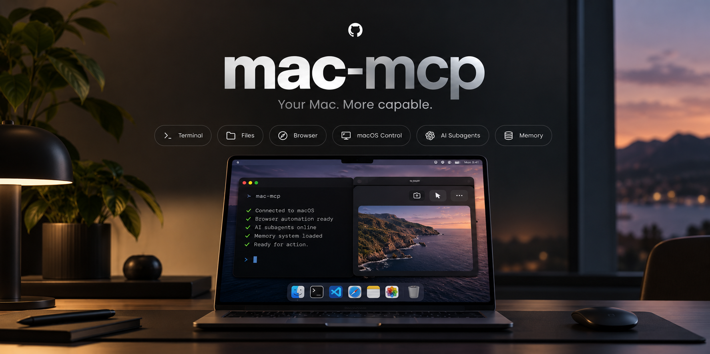

<p align="center">
  
</p>

# Mac MCP 2.0

Mac MCP is a local macOS control server for AI agents. It exposes your Mac through a native MCP endpoint and a REST/OpenAPI surface, with shell, files, browser automation, macOS UI control, delegated OpenCode/Codex agents, memory, Agent Skills, voice interaction, self-update tooling, and a local operations dashboard.

> **Security:** Mac MCP can execute commands, read/write files, and control desktop apps. Keep authentication enabled whenever the service is reachable outside localhost and expose it only to clients you trust. The operations dashboard is loopback-only.

## What's new in 2.0.5

- Mac MCP now presents a **21-tool core surface by default** instead of sending the full tool catalog to every MCP client. The complete registry remains available through `tool_discover` + `tool_invoke`, so older capabilities are not removed.
- The registered capability set is now **84 tools total**: the previous 81 tools plus `browser_do`, `tool_discover`, and `tool_invoke`. All previous 81 tools remain callable.
- Added `browser_do` for one-call browser transactions: open a URL, wait, interact, extract targeted fields, optionally verify state, and optionally close the newly opened tab without extra MCP round trips.
- Added targeted browser `extract` actions so agents can request only the data they need instead of pulling large DOM/HTML payloads into context.
- `browser_find` and `browser_act` are now part of the default core surface; visual observations retain compact DOM IDs alongside the image, and semantic browser extraction is more resilient on dynamic pages such as Google Maps.
- Reduced default browser observation payloads and disabled macOS screenshots by default for `mac_observe`, cutting unnecessary context and capture work.
- Hardened `network_idle` waits against Safari's transient `about:blank` state and preserved normal risk/profile enforcement for dynamically invoked tools.
- In local compatibility testing, tool-schema context fell from about **16.7k to 4.5k tokens (~73% less)** while all previous 81 tools retained an access path.
- Set `MAC_MCP_TOOL_PROFILE=full` if a client explicitly needs the entire registered catalog advertised up front.

## What's new in 2.0

- Native **Mac MCP.app** menu bar controller written in SwiftUI. It runs without a Dock icon and remains independent from the Python server.
- Start, Stop, Restart, Update, Dashboard, server status, ngrok status, success rate, recent tool usage, and delegated-agent status are available from the menu bar.
- **Latest Tool Usage** shows up to five rows at once and scrolls internally for older calls.
- **Delegated Agents** keeps a compact fixed-height list and scrolls internally when multiple active/recent agents exist. Active work also triggers a lightweight animated robot and a pulsing menu bar status icon.
- **Live agent steering** adds persistent logical Sessions to the menu bar, so you can redirect a specific agent while it is working or queue a new instruction while it is idle without sending the prompt to the wrong conversation.
- The menu bar treats dashboard reachability as a first-class state: **Connected**, **Degraded**, **Disconnected**, or **Connecting**. Failed fetches never masquerade as an empty session list; the last successful session snapshot is retained and marked **stale** until a successful refresh replaces it.
- Polling uses bounded exponential backoff after failures (`1s → 2s → 4s → 8s → 16s → 30s max`) and resets to the normal 2.5-second interval after recovery. A manual **Retry** performs an immediate refresh.
- **Voice** is a collapsed disclosure section by default. `ask_user_voice` can be enabled/disabled live without removing the MCP tool from discovery.
- When voice is disabled, calls return `experimental_tool_disabled` and instruct the agent to fall back to `ask_user`.
- Groq API keys can be stored in **macOS Keychain** instead of plaintext configuration.
- Voice input/output pickers enumerate connected CoreAudio devices such as AirPods, built-in microphone, and speakers.
- Runtime settings are read live from `~/.mac-mcp/settings.json`; voice changes do not require an MCP restart.
- The updater now carries the native `menu_app/` runtime alongside `mcp_server/` and refreshes an already-installed menu app after updates.

## Browser automation that doesn't hijack your Mac

Mac MCP can inspect and interact with Safari and Chrome tabs in the background while you keep working in another app or browser tab. Here, **background** means a normal, visible Safari/Chrome tab that Mac MCP controls without bringing the browser or tab to the front; it is not a hidden/headless browser session.

- New browser tabs open in the background by default and return a stable `tab_handle`.
- Stable tab handles survive tab-index changes, so long-running tasks keep targeting the intended Safari or Chrome tab even as other tabs open, close, or move.
- `browser_observe` can return compact DOM context plus viewport, element, or full-page visuals without activating the browser, switching tabs, scrolling the user's page, or leaving screenshot files on disk.
- High-level browser actions can target a specific background tab directly by handle, which makes parallel research and delegated-agent workflows practical without constant focus stealing.
- Foreground-only fallbacks such as native key presses and absolute coordinate clicks fail closed unless foreground access is explicitly requested.
- The native menu bar controller surfaces live browser work in **Sessions** and **Latest Tool Usage** with a privacy-minimized browser/site/action summary. URL paths, query strings, page titles, selectors, and page content are intentionally omitted from this compact view.
- **Show Tab** is an explicit user action: normal automation remains non-focus-stealing, while clicking Show Tab brings that specific real Safari/Chrome tab to the front.

This is designed for workflows where an AI agent keeps working in one or more background browser tabs while the Mac remains usable normally.

## Requirements

- macOS 13+
- Apple Silicon or Intel Mac
- Python 3.10+
- Git
- Xcode Command Line Tools (`swiftc`)
- ngrok only if you want a public HTTPS MCP endpoint

```bash
brew install python git ngrok
```

Optional helpers:

```bash
brew install cliclick brightness
```

## Install

### Recommended: one-line installer

The easiest way to install Mac MCP on a new Mac is the interactive installer:

```bash
curl -fsSL https://raw.githubusercontent.com/bulutarkan/mac-mcp/main/install.sh | bash
```

The installer is designed specifically to work safely through `curl | bash` while still reading interactive answers from the real terminal. It:

- verifies macOS 13+, Apple Silicon or Intel, Git, Python 3.10+, Xcode Command Line Tools, and `swiftc`;
- can offer Homebrew when a required dependency is missing, while keeping optional helpers such as `cliclick` and `brightness` optional;
- creates a Git source checkout at `~/Projects/mac-mcp` and a separate runtime at `~/mac-mcp` without Git metadata;
- creates and verifies the Python virtual environment and dependencies;
- generates a strong MCP API key, enables authenticated access, and stores the runtime `.env` with mode `600`;
- installs the `mac-mcp` CLI at `~/.local/bin/mac-mcp` and records the deployed commit for the built-in updater;
- builds and code-sign verifies the native `Mac MCP.app` menu bar controller in `~/Applications`;
- shows both Bearer-token and `?ApiKey=` connection formats at the end;
- does **not** install OpenCode or Codex. If you want to use Subagents, install either provider separately.

Existing source/runtime/CLI paths are never silently overwritten. If Mac MCP is already installed, use the built-in updater instead of re-running the installer over the same paths.

### Manual installation

If you prefer to manage the checkout and Python environment yourself:

```bash
git clone https://github.com/bulutarkan/mac-mcp.git
cd mac-mcp
python3 -m venv .venv
source .venv/bin/activate
pip install -e .
cp mcp_server/.env.example mcp_server/.env
```

Configure at minimum:

```env
MCP_API_KEY=replace-with-a-long-random-token
MCP_ALLOW_NO_AUTH=false
MCP_ALLOW_SHELL=true
RATE_LIMIT_PER_MINUTE=120

# Optional public tunnel
NGROK_DOMAIN=your-domain.ngrok-free.dev
```

Generate a strong token:

```bash
python3 - <<'PY'
import secrets
print(secrets.token_urlsafe(48))
PY
```

When authentication is enabled, the preferred client credential is still:

```http
Authorization: Bearer <MCP_API_KEY>
```

For MCP clients/connectors that cannot set an `Authorization` header, Mac MCP also accepts the configured global key in the endpoint URL:

```text
https://your-domain.example/mcp?ApiKey=<MCP_API_KEY>
```

`Authorization` remains authoritative when both forms are supplied. Empty, duplicate, or invalid `ApiKey` query credentials are rejected while authentication is enabled. The server removes `ApiKey` from its local access-log URL before logging, but upstream proxies/tunnels can still observe query strings, so Bearer headers should be preferred whenever the client supports them.

## Permission profiles and approval semantics

Mac MCP treats **capability enforcement** and **human approval** as separate security concepts. A capability being allowed means only that the Mac MCP server policy permits that tool/risk class. It does **not** mean a second confirmation prompt will appear before the action runs.

| Profile | Server-enforced capability behavior | Approval source | Automatic Mac MCP prompt |
| --- | --- | --- | --- |
| `trusted` | All registered capabilities; destructive families are not additionally restricted by the profile. | `none` | No |
| `standard` | Blocks `raw_execution` and `update_control`; destructive operations are limited to browser/accessibility families; access-mode ceiling is read-only. | `none` | No |
| `read_only` | Allows read/network/browser/native-accessibility capabilities only and denies destructive calls. | `none` | No |

`ask_confirmation` is an explicit interaction tool. It is **not** an automatic approval gate around other tools. A connected MCP client may implement its own approval UI, but that is client-side behavior and is not guaranteed by Mac MCP. Likewise, a future server-side or external guard can be represented explicitly as approval source `server` or `external`; Mac MCP does not currently advertise an “approval-heavy” preset because that name would imply a guarantee that does not exist.

Delegated Codex workers currently run with Codex `approval_policy="never"`; their sandbox/access mode is separate from human approval. OpenCode permission behavior is also provider-side and must not be treated as a Mac MCP server confirmation guarantee.

Set the server capability profile with `MAC_MCP_PERMISSION_PROFILE=trusted|standard|read_only`. The native menu bar app reads `/dashboard/api/security/semantics` and shows **Allowed Capabilities** and **Approval Behavior** separately for the active profile. The three preset rows are clickable: choosing one persists the value in `mcp_server/.env` and applies it to new global requests immediately without restarting the server or ngrok. Existing delegated agents keep the scoped profile issued when they were started; new agents inherit the newly selected parent profile.

## Install the menu bar app

```bash
./menu_app/install_app.sh
```

Default location:

```text
~/Applications/Mac MCP.app
```

The app is independent from the server:

- quitting the app does **not** stop MCP;
- stopping MCP does **not** quit the app;
- `mac-mcp start` opens the app automatically when it is installed;
- server controls remain available even while the Voice section is collapsed.

The app uses the existing localhost dashboard APIs:

```text
/dashboard/api/summary
/dashboard/api/security/semantics
/dashboard/api/events
/dashboard/api/agents
/dashboard/api/steering
```

### Live menu-bar steering

Mac MCP keeps a **logical agent session** visible between tool calls instead of showing it only for the few milliseconds while a tool is running. It prefers stable conversation metadata supplied by the MCP client (for example OpenAI's conversation-scoped `openai/session` metadata), then generic `_meta.client_id`, and finally a reused stateful Streamable HTTP transport as a fallback. Raw identity values are hashed before entering steering state and are never exposed in the dashboard. This matters for hosts that create a fresh transport session for every tool call: repeated calls from the same conversation still collapse into one **Working / Idle** agent card.

Steering messages are kept in memory only and are bound to the selected logical agent, never to a global "next caller" queue. If the selected agent currently has a tool running, the prompt is appended to that tool's live response as structured `_mac_mcp_steering` content. If the agent is idle, the prompt remains queued for that logical session and its next requested tool is **preempted before execution** with a `mac_mcp_steering_preempted` tool error, so the agent sees the user's new direction before doing more work. A different conversation/session cannot consume that prompt. Logical steering sessions expire after 10 minutes of inactivity by default. The menu-bar **Sessions** disclosure lets you enter any positive number of minutes and persists that value in `~/.mac-mcp/settings.json`; stateful protocol transports are separately bounded so short-lived client transports do not accumulate indefinitely. Raw steering text is not written into telemetry SQLite, and nested fallback calls such as `tool_invoke` do not create duplicate visible sessions.

For example, if an agent is researching in a background Safari tab and you type `stop using Airbnb and check Booking.com instead` into that agent's Session, Mac MCP routes the instruction only to that logical agent. A running tool can return the steering immediately; an idle agent is interrupted before its next tool call so it can change course first.

### Versioned session lifecycle

The steering API exposes `schema_version: 1` and separates **activity** from **instruction lifecycle**. Legacy `state=working|idle` and `queued` fields remain for compatibility; new clients should prefer `activity_state`, `lifecycle_state`, `pending_instruction_count`, `last_transition_at`, and `last_error`.

The instruction lifecycle is intentionally small: `ready → queued → delivered → acknowledged`. If the underlying tool fails before queued steering can be delivered, the session enters `failed` while keeping the instruction pending for the next tool call. Transport-backed sessions emit `disconnected` when their MCP transport disappears, and idle sessions emit `expired` when their retention TTL elapses. Illegal lifecycle transitions are rejected internally instead of silently producing ambiguous state.

`acknowledged` is inferred when the same logical agent makes its next top-level tool request after receiving steering; it means the agent continued after the delivery boundary, not that the model sent a separate acknowledgement packet. Daemon/API reachability is a different connection concern and is handled separately by the menu app's connection UX.

### Menu bar connection resilience

The native controller does not treat a failed dashboard request as valid empty data. A successful empty `/dashboard/api/steering` response clears the session list normally; an HTTP error, timeout, or connection refusal preserves the last successful snapshot and marks it stale. If the app has never received a valid session snapshot, it shows **Session data unavailable** rather than **No agent sessions yet**.

A transport failure such as timeout or connection refusal enters `disconnected`; an HTTP error or invalid response from a reachable server enters `degraded`, including failures from the primary summary endpoint. HTTP status failures, timeouts, and connection-refused errors are surfaced separately. Automatic polling backs off from 1 second to a 30-second cap and returns to the normal 2.5-second cadence after the next complete successful refresh.

## Server commands

```bash
mac-mcp start
mac-mcp start --ngrok
mac-mcp status
mac-mcp restart --ngrok
mac-mcp stop
mac-mcp dashboard
```

Default local endpoint:

```text
http://127.0.0.1:8000/mcp
```

A custom port can be supplied through `MAC_MCP_PORT` or CLI flags.

## Voice interaction

`ask_user_voice` speaks a short prompt, records the local answer, transcribes it with Groq Whisper, and returns the transcript to the calling agent.

The menu app manages:

- experimental enable/disable toggle;
- Groq API key in macOS Keychain;
- input microphone;
- output device;
- language;
- timeout;
- TTS voice and rate.

Non-secret settings are stored in:

```text
~/.mac-mcp/settings.json
```

Environment variables remain supported as fallbacks, including `MAC_MCP_VOICE_GROQ_API_KEY`, `GROQ_API_KEY`, `MAC_MCP_VOICE_LANGUAGE`, `MAC_MCP_VOICE_INPUT_DEVICE`, `MAC_MCP_VOICE_OUTPUT_DEVICE`, and `MAC_MCP_VOICE_TTS_RATE`.

## Operations dashboard

Open:

```text
http://127.0.0.1:<port>/dashboard
```

The dashboard records sanitized MCP/REST tool activity, status, latency, recent delegated-agent state, active calls, and tool frequency. Telemetry persists locally under:

```text
~/.mac-mcp/dashboard/telemetry.sqlite3
```

The dashboard is restricted to loopback access even when `/mcp` is exposed through ngrok.

## Tool coverage

Mac MCP 2.0.5 advertises a compact **21-tool core surface by default**, backed by **84 registered MCP capabilities**. The 63 less-common tools remain available through `tool_discover` and `tool_invoke`, including every tool from the previous 81-tool surface.

Set `MAC_MCP_TOOL_PROFILE=full` to advertise all registered tools directly to the client. You can also add selected tools to the compact surface with `MAC_MCP_CORE_EXTRA_TOOLS=name1,name2`.

The capability set covers:

- terminal/system and background jobs;
- delegated OpenCode/Codex agents;
- file management;
- macOS automation and Accessibility UI control;
- Safari/Chrome browser automation with stable tab handles and background visual observation;
- HTTP and search;
- text/choice/confirmation/voice human input;
- persistent memory;
- Agent Skills;
- safe self-update.

Use MCP tool discovery for the authoritative live schema.

## Updating

```bash
mac-mcp update --check
mac-mcp update
```

The updater follows `origin/main`, blocks on dirty repositories, preserves runtime overlays and private files, creates a runtime backup, restarts the managed service, performs a health check, and rolls back managed runtime files if verification fails.

In 2.0, `menu_app/` is part of the managed runtime. If `Mac MCP.app` is already installed, a successful update rebuilds and refreshes it automatically.

## macOS permissions

Grant only the permissions required by the tools you use:

- **Accessibility** for `mac_observe`, `mac_act`, System Events, and desktop automation;
- **Screen Recording** for protected screen capture;
- **Automation** when macOS asks permission to control Safari, Chrome, System Events, Reminders, or other apps;
- **Microphone** for `ask_user_voice`.

## Development

Run tests:

```bash
python -m unittest discover -s tests -v
```

Build the native menu app without installing it:

```bash
./menu_app/build_app.sh /tmp/mac-mcp-build
```

Project layout:

```text
mcp_server/   Python MCP server and dashboard
menu_app/     Native SwiftUI menu bar controller
tests/        Regression tests
openapi/      REST/OpenAPI schema assets
```

## License

MIT
