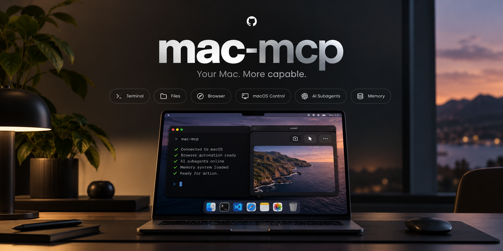

<p align="center">
  
</p>

# Mac MCP 2.1.9

Mac MCP is a local macOS control server for AI agents. It exposes your Mac through a native MCP endpoint and a REST/OpenAPI surface, with shell, files, browser automation, macOS UI control, delegated OpenCode/Codex agents, memory, Agent Skills, voice interaction, self-update tooling, and a local operations dashboard. The native MCP endpoint is the full capability surface; REST/OpenAPI intentionally publishes a selected compatibility subset, so some capabilities remain MCP-only.

## Talk to ChatGPT. Let it work on your Mac.

Mac MCP is model-agnostic and works with MCP-compatible AI clients. But ChatGPT is an especially natural way to use it.

ChatGPT Live can use plugins during voice conversations. With Mac MCP connected, the same ChatGPT conversation you already use can become a control surface for your actual Mac. You can talk naturally while Mac MCP handles the execution: browsing in Safari or Chrome, working with files, opening apps, running commands, and coordinating agents.

Instead of moving every task into a separate coding-agent session, you can keep the interaction in ChatGPT and simply talk. From your phone, you can ask ChatGPT to work on a reachable Mac somewhere else. From your desktop, you can keep talking while Mac MCP works in the background without taking over the computer.

For example:

- "Check my Reddit replies, answer the important ones, and close the browser when you are done."
- "Go through the repo, run the tests, and tell me what is broken."
- "Find three hotels for next weekend, compare the reviews, and save the shortlist on my Mac."

**ChatGPT is the conversation. Mac MCP is the execution layer.**

### The Mac MCP panel in ChatGPT

When Mac MCP is connected as a ChatGPT plugin, ChatGPT also shows Mac MCP as an app you can open next to your conversations: from the ChatGPT sidebar in full screen, or as a side panel inside any chat. The panel shows tool activity, delegated agents and token usage at a glance, and lets you choose the default agent ChatGPT delegates to. It refreshes only when you press refresh.

The panel is offered only to ChatGPT; other MCP clients keep their normal tool list. Everything it does goes through the same permission profiles and approvals as any other Mac MCP call, and it never receives API keys, tokens or credentials. To turn it off, set `{"chatgpt_extensions": {"enabled": false}}` in `~/.mac-mcp/settings.json`. See [docs/chatgpt-control-center.md](docs/chatgpt-control-center.md) for details.

This is a powerful combination, not a Mac MCP-only voice feature. ChatGPT provides the natural voice interface and reasoning experience; Mac MCP gives it a local execution layer on macOS. Existing ChatGPT plugin permissions, approvals, and usage limits still apply, and Mac MCP keeps its normal permission, background-control, outcome-safety, and undo boundaries.

> **Security:** Mac MCP can execute commands, read/write files, and control desktop apps. Keep MCP authentication enabled whenever the service is reachable outside localhost and expose it only to clients you trust. The operations dashboard is loopback-only **and** requires a separate per-user dashboard Bearer token; localhost is machine-local transport, not a same-user sandbox.

**Secure bootstrap defaults:** missing configuration fails closed. Without explicit settings, MCP authentication is required, shell execution and HTTP/browser host allowlists are disabled, and the global permission profile defaults to `standard` rather than `trusted`. A normal installer run generates the API key and writes the intended settings explicitly. Deliberate `MCP_ALLOW_NO_AUTH=true` is accepted only on loopback with no managed public endpoint; non-loopback or tunneled no-auth startup is refused.

## What's new in 2.1.9

2.1.9 brings Mac MCP into ChatGPT itself with a native plugin panel, and makes everyday browser work, approvals, updates and restarts more dependable.

- **Mac MCP panel inside ChatGPT:** ChatGPT now shows Mac MCP as a plugin app. Open it from the ChatGPT sidebar in full screen or as a side panel in any conversation. A compact black-and-white panel, in the same style as the Mac MCP website, shows today's tool activity, running and recent delegated agents, and 7-day token usage for Codex, OpenCode and ChatGPT Web. It refreshes only when you press refresh, so it never polls your Mac in the background.
- **Choose your default agent from ChatGPT:** the panel's Settings tab lets you pick the provider, model and reasoning level ChatGPT uses when it delegates work. Models come from your own provider accounts, and the server checks every choice before saving. Notifications and connection details are shown read-only; permissions, providers and credentials still live only in the Mac app.
- **ChatGPT-only and permission-bound:** Claude, Codex, OpenCode and other clients never see the panel. Every action from it passes the same permission profiles and approvals as any other Mac MCP call, and no keys or tokens are sent to it.
- **See what your agents are doing:** optional activity bubbles on the Mac show what each tool call is for while it runs, even when several run at once, and optional notifications tell you when a delegated agent finishes.
- **Optional server approvals:** a new Server Approval setting (`Off`, `Critical`, `High Risk`) can ask you to **Allow Once** or **Block** risky actions such as raw commands, update control, or destructive browser and app actions.
- **Smoother browser work:** agents can finish whole forms in a single step: they can press keys and Enter without bringing the browser to the front and wait for buttons that appear a moment later. Safari tabs stay tracked across site changes and tab shuffling, clicks whose effect appears elsewhere on the page count as working, and page images now work on pages such as Google Sheets.
- **Better picks between look-alike targets:** Mac MCP now prefers the actual button over the boxes around it. An optional Decision Acceleration layer (off by default, uses your own OpenAI key) can break remaining ties, guided by a short hint from the agent.
- **Easier setup and history:** `mac-mcp connect-config` prints ready-to-paste connection settings for ChatGPT, Codex and OpenCode; the dashboard adds a safe transaction history view; and memory and Agent Skills can be read over REST.
- **More dependable updates and restarts:** updates started from inside Mac MCP survive their own restart, `mac-mcp restart` no longer leaves the server stopped, background jobs keep tracking the programs they start, and update operations no longer replace your own Git identity.
- **Accessibility:** the browser Visual Companion announces activity to screen readers and works with the keyboard.


## Browser automation that doesn't hijack your Mac

Mac MCP can inspect and interact with Safari and Chrome tabs in the background while you keep working in another app or browser tab. Here, **background** means a normal, visible Safari/Chrome tab that Mac MCP controls without bringing the browser or tab to the front; it is not a hidden/headless browser session.

- New browser tabs open in the background by default and return a stable `tab_handle`.
- Stable tab handles survive tab-index changes, so long-running tasks keep targeting the intended Safari or Chrome tab even as other tabs open, close, or move. Each AppleScript step re-resolves the tab by its native identity, so a shift in the middle of a `browser_act` call does not fail it; if the target tab itself closes, the call returns `tab_target_closed` with the actions that already completed and `automatic_retry: false` instead of an HTTP error.
- `browser_observe` can return compact DOM context plus viewport, element, or full-page visuals without activating the browser, switching tabs, scrolling the user's page, or leaving screenshot files on disk.
- High-level browser actions can target a specific background tab directly by handle, which makes parallel research and delegated-agent workflows practical without constant focus stealing.
- Foreground-only fallbacks such as native key presses, absolute coordinate clicks, foreground URL opens, and Safari's native file-picker path are **capability-gated**. A model cannot grant itself focus by sending `allow_foreground=true` or `background=false`.
- `browser_activate_tab` is treated as user-visible foreground behavior even when it would not raise the browser app, because changing Safari's current tab or Chrome's active tab can interrupt a user already working there. Normal automation should target stable `tab_handle` values directly without activating them.
- The native menu bar controller surfaces live browser work in **Sessions** and **Latest Tool Usage** with a privacy-minimized browser/site/action summary. URL paths, query strings, page titles, selectors, and page content are intentionally omitted from this compact view.
- **Settings → Usage → Data & Retention** controls usage history: turn recording off, keep 30, 90 or 365 days (default 365), or clear all stored tool and provider usage. Only daily per-tool aggregates are kept, never prompts, arguments or results; a shorter period removes older days immediately.
- **Show Tab** is the explicit local-user action: only that trusted UI path receives a short lexical foreground capability and can bring that specific real Safari/Chrome tab to the front.

This is designed for workflows where an AI agent keeps working in one or more background browser tabs while the Mac remains usable normally.

### Faster decisions on look-alike targets with the OpenAI Decisions API

Real pages are full of near-duplicates: a **Continue** button under both Shipping and Billing, **Reply** next to **Reply all**, two **25** cells in a two-month date picker. A typical agent stops there, observes the page again and spends another model round trip choosing. Mac MCP can settle it inside the same `browser_act` call instead.

When Decision Acceleration is on, Mac MCP sends the already-ranked candidates to the [OpenAI Decisions API](https://developers.openai.com/api/docs/guides/decisions), OpenAI's typed-answer endpoint for fast classification and routing (OpenAI describes it as about 10x faster than the Responses API). Mac MCP gives each call a 600 ms budget; a warm call measured under ~330 ms. The agent can add a one-line `intent` hint, such as "the Billing step", and that hint decided our calibration cases:

| Ambiguous target | Without hint | With `intent` |
|---|---|---|
| Shipping vs Billing **Continue** | 0.16, kept the first match | Billing, 0.83 |
| **Reply** vs **Reply all** | Reply | Reply all, 0.93 |
| Two **25** calendar cells | no answer, 0.28 | November 25, 0.82 |

The layer can only pick from candidates Mac MCP already found, never chooses a risky action such as delete, send or pay over the deterministic match, and falls back to the normal path on any timeout, error or low confidence. It is off by default, uses your own OpenAI key from Keychain, and sends only short redacted labels: no typed values, URLs or page content. Setup and thresholds are under [Optional Decision Acceleration](#optional-decision-acceleration-experimental).

### Browser Visual Companion (Safari + Chrome)

`Mac MCP.app` uses one shared WebExtension source for Safari and Chrome to make active Mac MCP browser work visible inside the exact page being automated. The extension is display-only: it renders a subtle pulsing page frame, a small `Mac MCP · …` activity badge, a synthetic cursor, and click feedback for high-level browser actions. Visual events contain only bounded action labels and viewport coordinates; typed text, selectors, URLs, page titles, DOM content, and secrets are not copied into the extension event. The overlay is activity feedback only and must not be treated as a security or trust indicator.

Safari setup depends on how `Mac MCP.app` is signed:

**Developer ID / Apple-signed build (persistent):**

1. Install or update Mac MCP normally.
2. Open **Mac MCP.app → Browser Activity → Enable in Safari…**. You can also use **Safari → Settings → Extensions**.
3. Turn on **Mac MCP Visual Companion** and grant website access for the sites where you want activity feedback.

**Local GitHub/source build (ad-hoc, development mode):**

1. Open **Mac MCP.app → Browser Activity → Developer Setup…**. Mac MCP reveals the runtime `BrowserVisualCompanion` source folder and opens Safari.
2. In Safari, enable web-developer features if the **Develop** menu is hidden.
3. Choose **Develop → Allow Unsigned Extensions**.
4. Choose **Develop → Add Temporary Extension…** and select `~/mac-mcp/menu_app/BrowserVisualCompanion`.
5. Grant website access when Safari asks. Safari treats this as a development/temporary extension; persistent normal installation requires an Apple-signed app bundle.

For Chrome, true background tab creation uses the Chrome-only `~/mac-mcp/menu_app/ChromeVisualCompanion` extension. Open **Mac MCP.app → Browser Activity → Chrome Setup…**, enable **Developer mode** at `chrome://extensions`, choose **Load unpacked**, and select that folder. The companion opens new tabs with Chrome's native `tabs.create({active:false})` API, so background work does not bring Chrome or the new tab to the front. If the companion is unavailable, background tab creation fails closed rather than falling back to a focus-stealing AppleScript open. The same companion also carries DOM/page execution through Chrome's `debugger` API, so normal Mac MCP Chrome reads, clicks, typing and background-safe visual capture do not require the Apple Events JavaScript toggle while the companion is connected. The Chrome companion uses a dedicated owner-only local credential and a loopback WebSocket; the credential is not the global `MCP_API_KEY`.

The project remains fully open source and does **not** need the Mac App Store. For a persistent GitHub release, sign/notarize the distributed `Mac MCP.app` with Developer ID; `menu_app/build_app.sh` accepts `MAC_MCP_CODESIGN_IDENTITY` for that release path.

No separate browser profile, helper daemon, or Xcode project is required. `menu_app/build_app.sh` compiles the `.appex` into `Mac MCP.app/Contents/PlugIns/` with the normal command-line Swift toolchain. Local builds default to ad-hoc signing; release builders can set `MAC_MCP_CODESIGN_IDENTITY` to use a Developer ID identity with hardened runtime/timestamp signing.

## Requirements

- macOS 13+
- Apple Silicon or Intel Mac
- Python 3.10+
- Git
- Xcode Command Line Tools (`swiftc`)
- ngrok only if you choose the built-in ngrok public endpoint mode
- cloudflared only if you choose the built-in Cloudflare Tunnel mode

```bash
brew install python git
# Optional public providers:
brew install ngrok       # ngrok mode
brew install cloudflared # Cloudflare Tunnel mode
```

Optional helpers:

```bash
brew install cliclick brightness
```

## Install

### Installer

The interactive installer now installs only a cryptographically verified stable release. It clones `main`, finds the newest signed stable-release commit, verifies the pinned bootstrap verifier, Ed25519 manifest signature, complete tracked-file SHA-256/mode/size inventory, aggregate payload digest, and release lineage **before** creating persistent source/runtime paths.

For convenience, the streamed bootstrap is still available:

```bash
curl -fsSL https://raw.githubusercontent.com/bulutarkan/mac-mcp/main/install.sh | bash
```

A streamed script cannot cryptographically authenticate itself before it starts executing. Treat that command as a lower-assurance bootstrap. For higher-assurance installation, obtain `install.sh` from a trusted signed release commit and independently compare the release-signer fingerprint documented in `release/README.md` before running it. Once the trusted installer is running, the cloned source/runtime payload is fail-closed and cryptographically verified.

The installer:

- verifies macOS 13+, Apple Silicon or Intel, Git, Python 3.10+, Xcode Command Line Tools, and `swiftc`;
- verifies the selected stable release cryptographically before moving any source/runtime files into persistent install paths;
- can offer Homebrew when a required dependency is missing, while keeping optional helpers such as `cliclick` and `brightness` optional;
- asks which public endpoint mode you want (`Local only`, `Cloudflare Tunnel`, `ngrok`, or `Custom HTTPS`) and, when Cloudflare/ngrok is selected, offers to install the matching provider with Homebrew if it is missing;
- can finish Cloudflare setup during installation by storing the public hostname in settings and accepting the tunnel token through a hidden terminal prompt; the token is sent to `mac-mcp credential cloudflare save` over stdin and is never placed in shell arguments, settings, or `.env`;
- creates a Git source checkout at `~/Projects/mac-mcp` and a separate runtime at `~/mac-mcp` without Git metadata;
- creates and verifies the Python virtual environment and dependencies;
- generates a strong MCP API key, enables authenticated access, and stores the runtime `.env` with mode `600`;
- installs the `mac-mcp` CLI at `~/.local/bin/mac-mcp` and records the deployed commit for the built-in updater;
- builds and code-sign verifies the native `Mac MCP.app` menu bar controller in `~/Applications`;
- shows both Bearer-token and `?ApiKey=` connection formats at the end;
- does **not** install OpenCode, Codex, or ChatGPT Web CLI. If you want to use Subagents, install the provider you plan to use separately.

Existing source/runtime/CLI paths are never silently overwritten. If Mac MCP is already installed, use the built-in updater instead of re-running the installer over the same paths.

### Manual installation

If you prefer to manage the checkout and Python environment yourself:

```bash
git clone https://github.com/bulutarkan/mac-mcp.git
cd mac-mcp
python3 -m venv .venv
source .venv/bin/activate
pip install --require-hashes -r requirements.lock
pip install --no-deps --no-build-isolation -e .
cp mcp_server/.env.example mcp_server/.env
```

`requirements.lock` pins every dependency, transitive packages and build tools included, by version and SHA-256 hash; the installer, the updater and CI all install from it, and pip refuses a package that does not match. After changing dependencies in `pyproject.toml`, regenerate it with the command at the top of the file (`uv pip compile ... --generate-hashes`).

Configure at minimum:

```env
MCP_API_KEY=replace-with-a-long-random-token
MCP_ALLOW_NO_AUTH=false
MCP_ALLOW_SHELL=true
RATE_LIMIT_PER_MINUTE=120

# Optional built-in ngrok provider
NGROK_DOMAIN=your-domain.ngrok-free.dev

# Optional environment overrides for public endpoint selection.
# Normally these are managed from Mac MCP Settings instead.
# MAC_MCP_PUBLIC_ENDPOINT_MODE=cloudflare
# MAC_MCP_PUBLIC_URL=https://mac.example.com/mcp
```

Generate a strong token:

```bash
python3 - <<'PY'
import secrets
print(secrets.token_urlsafe(48))
PY
```

When authentication is enabled, the preferred client credential is still:

```http
Authorization: Bearer <MCP_API_KEY>
```

For MCP clients/connectors that cannot set an `Authorization` header, Mac MCP also accepts the configured global key in the endpoint URL:

```text
https://your-domain.example/mcp?ApiKey=<MCP_API_KEY>
```

### Generate a client connection config

Use the CLI to generate a connection snippet from the Mac MCP endpoint and authentication state that are actually configured on this Mac:

```bash
mac-mcp connect-config --client chatgpt
mac-mcp connect-config --client codex
mac-mcp connect-config --client opencode
```

The command never prints the configured API-key value. Codex and OpenCode snippets reference a client-side environment variable (`MAC_MCP_API_KEY` by default); set that variable in the client process to the same secret value configured as Mac MCP's `MCP_API_KEY`. ChatGPT uses the existing header-limited query-key compatibility form and prints only `?ApiKey=<API_KEY>` as a placeholder.

`--endpoint auto` is the default: it uses the configured public HTTPS endpoint for ChatGPT and loopback for local Codex/OpenCode. Use `--endpoint public` when Codex/OpenCode run elsewhere, or `--endpoint local` to force loopback where supported. `--name` changes the client-side server ID, and `--auth-env` changes the client environment-variable name without exposing its value.

Client config formats evolve. The generated output labels the target format it assumes; prefer regenerating the snippet with your installed Mac MCP instead of copying an old README fragment.

### Public endpoint modes

Mac MCP treats the local server and its public transport as separate layers. **Local only** exposes no managed public endpoint. **ngrok** runs a managed ngrok process and uses `NGROK_DOMAIN`. **Cloudflare Tunnel** runs `cloudflared` directly on the Mac and connects the selected named tunnel (or an owner-controlled token file) to `127.0.0.1:<port>`; no VPS, reverse proxy, inbound port-forward, or public Mac IP is required. **Custom HTTPS** records an externally managed HTTPS MCP endpoint and does not start a tunnel provider.

The native Settings window provides a four-way `Local only / ngrok / Cloudflare / Custom HTTPS` switch. The selection is persisted under `server.public_endpoint_mode` and `server.public_url` in `~/.mac-mcp/settings.json`; optional named-tunnel metadata may use the non-secret `server.cloudflare_tunnel` field. Existing installations that only have `ngrok_on_start=true` continue to behave as ngrok mode until the new setting is saved. Environment variables `MAC_MCP_PUBLIC_ENDPOINT_MODE` and `MAC_MCP_PUBLIC_URL` can override persisted values for managed/headless deployments.

### Cloudflare Tunnel: 5-minute setup

The interactive installer can do the Mac-side setup for you. Choose **Cloudflare Tunnel** when `install.sh` asks for a public endpoint. If `cloudflared` is missing, the installer offers `brew install cloudflared`; declining it does not break the core install and leaves Mac MCP in **Local only** mode.

For the Cloudflare-side setup:

1. Your domain must be active in Cloudflare. In the Cloudflare dashboard, go to **Networking → Tunnels**, choose **Create tunnel**, and give it any name that identifies this Mac.
2. Open the tunnel's **Routes** tab, choose **Add route → Published application**, select the hostname you want (for example `mac.example.com`), and point the service to `http://localhost:8000` for a default install. If you changed Mac MCP's server port, use that port instead.
3. Cloudflare shows a `cloudflared` setup/install command for the connector. **Do not run the service-install command when Mac MCP is managing the tunnel.** Copy only the tunnel token from that command. For an existing tunnel, **Add a replica** also exposes a connector command containing the token.
4. Back in the Mac MCP installer, enter the public hostname such as `https://mac.example.com` and paste the token into the hidden prompt. If you skip either value, the installer safely leaves the public mode as **Local only**; finish later in **Mac MCP.app → Settings → Advanced → Cloudflare**.
5. Start Mac MCP. `mac-mcp start` creates/enables a per-user `launchd` job with `KeepAlive`; no Terminal window has to remain open. Verify with `mac-mcp status` and `mac-mcp doctor`.

Cloudflare's current documentation calls this a remotely-managed tunnel and a **Published application** route. See [Set up Cloudflare Tunnel](https://developers.cloudflare.com/tunnel/get-started/), [Add routes](https://developers.cloudflare.com/cloudflare-one/networks/routes/add-routes/), and [Tunnel tokens](https://developers.cloudflare.com/tunnel/reference/tunnel-tokens/). A tunnel token is a credential: anyone who has it can run a connector for that tunnel, so rotate it in Cloudflare if it is ever exposed.

For the simplest Cloudflare setup, create the tunnel and hostname in Cloudflare, then paste the tunnel token once into **Settings → Advanced → Cloudflare**. Mac MCP writes it atomically to `~/.mac-mcp/cloudflare-tunnel-token` as an owner-only `0600` file, never writes the token into `settings.json` or `.env`, never re-displays it, and starts `cloudflared` with `--token-file` so the secret is not exposed in process arguments. `CLOUDFLARE_TUNNEL_TOKEN_FILE` may override the credential-file path without putting the token value in the environment. Named-tunnel credentials remain available as an advanced alternative. The tunnel connects Cloudflare directly to `http://127.0.0.1:<port>` on the Mac: no VPS, public IP, router port forwarding, or inbound firewall opening is required. Custom mode is for operators who already provide their own external HTTPS routing. All public URLs must be HTTPS and may not contain query strings, fragments, or URL userinfo. `mac-mcp status` shows the selected connector URL and `mac-mcp doctor` checks the selected provider, credential-file safety, and public `/health` route without sending the MCP API key. Switching providers stops any managed ngrok/cloudflared process that is no longer selected. In Cloudflare mode, `mac-mcp start` (and the native app Start action) installs/enables a user LaunchAgent with `KeepAlive`, so the tunnel stays independent of Terminal and is automatically restarted if `cloudflared` exits; `mac-mcp stop` boots out and disables that job.

`Authorization` remains authoritative when both forms are supplied. Empty, duplicate, or invalid `ApiKey` query credentials are rejected while authentication is enabled. The server removes `ApiKey` from its local access-log URL before logging, but upstream proxies/tunnels can still observe query strings, so Bearer headers should be preferred whenever the client supports them.

## Product and security terminology

Mac MCP uses a small canonical glossary so UI and documentation do not imply stronger isolation or invisibility than the product actually provides. See [`docs/TERMINOLOGY.md`](docs/TERMINOLOGY.md) for the full definitions.

- **Background browser automation:** visible, non-focus-stealing Safari/Chrome automation; not hidden or headless.
- **Capability:** whether the Mac MCP server policy permits a tool/risk class.
- **Approval:** a human-confirmation mechanism and its source; separate from capability enforcement.
- **Localhost / loopback:** machine-local transport, not same-user isolation or a sandbox.
- **Mac MCP logical session:** a local hashed steering identity that keeps one agent/conversation flow coherent; not the raw provider identity.
- **Dedicated user:** containment/hardening that reduces blast radius; not a complete sandbox.

For an advanced two-account deployment, see **[Hardened deployment with a dedicated non-admin macOS user](docs/HARDENED_DEDICATED_USER.md)**. It covers loopback authentication, an explicit ACL-shared directory, TCC/GUI-session limits, tool behavior, rollback, and a two-user validation matrix.

## Permission profiles and approval semantics

Mac MCP treats **capability enforcement** and **human approval** as separate security concepts. A capability being allowed means only that the Mac MCP server policy permits that tool/risk class. It does **not** mean a second confirmation prompt will appear before the action runs.

| Profile | Server-enforced capability behavior | Approval source with Server Approval `Off` | Automatic risk prompt |
| --- | --- | --- | --- |
| `trusted` | All registered capabilities; destructive families are not additionally restricted by the profile. | `none` | No |
| `standard` | Blocks `raw_execution` and `update_control`; destructive operations are limited to browser/accessibility families; access-mode ceiling is read-only. | `none` | No |
| `read_only` | Allows read/network/browser/native-accessibility capabilities only and denies destructive calls. | `none` | No |

**Server Approval** is an optional approval overlay, separate from these capability profiles. It defaults to `Off`. `Critical` requires Mac MCP **Allow Once / Block** confirmation for raw execution, update control, and destructive process-control calls. `High Risk` adds destructive external/browser/native actions. The overlay is evaluated only after capability enforcement, uses exact-action single-use grants, denies when an approval is required but the local approval provider is unavailable or times out, and can be changed from **Settings → Permissions & Safety** without restarting the server. Mac MCP does not accept a client-supplied “already approved” claim as proof to bypass this server gate; client/external approval may still apply independently.

`ask_confirmation` remains an explicit interaction tool and is not a blanket confirmation wrapper around normal tool calls. Separately, Mac MCP has mandatory narrow server-side security gates for risky trust-boundary crossings. Under `standard` and scoped delegated profiles, an untrusted web context → privileged host action can require a source-aware **Allow Once / Block** decision. The global `trusted` profile intentionally skips that routine web→host confirmation so trusted interactive workflows are not interrupted on every shell/file/UI hop unless the optional Server Approval overlay independently matches the action. Detected credential/secret egress to an untrusted origin remains source-aware and approval-gated even under `trusted`. Exact-action grants remain origin-bound and single-use.

Delegated Codex workers currently run with Codex `approval_policy="never"`; their sandbox/access mode is separate from human approval. OpenCode permission behavior is also provider-side and must not be treated as a Mac MCP server confirmation guarantee.

Set the server capability profile with `MAC_MCP_PERMISSION_PROFILE=trusted|standard|read_only`. The native menu bar app reads `/dashboard/api/security/semantics` and shows **Allowed Capabilities**, **Approval Behavior**, and the optional **Server Approval** risk profile separately. Permission-profile changes persist in `mcp_server/.env`; Server Approval persists as `security.server_approval_profile` in owner-only `~/.mac-mcp/settings.json`. Both apply to new requests immediately without restarting the server. Existing delegated agents keep the scoped capability profile issued when they were started; the server-side risk approval overlay remains a server execution gate.

Browser resilience guards are configurable with `MAC_MCP_NO_PROGRESS_THRESHOLD` (default `4`, range `2–10`) and `MAC_MCP_TAB_LEASE_TTL_S` (default `300` seconds, range `30–3600`). The no-progress breaker stops only repeated meaningful browser actions that fail to change DOM revision, URL, or title; wait/scroll/extract flows do not consume that budget. Delegated-agent tab ownership is logical and time-bounded: completing/cancelling/crashing an agent releases ownership without closing the user's tab, and the next agent must make a fresh `browser_observe` before acting on a previously owned handle.

### Outbound URL / SSRF boundary

`http_request` and `browser_open_url` treat public hostname allowlists and private-network access as separate permissions. A wildcard `HTTP_ALLOWLIST=*` or `BROWSER_ALLOWLIST=*` permits public hostnames; it does **not** permit loopback, RFC1918/ULA, link-local/metadata, carrier-grade NAT, multicast, unspecified, reserved, or other non-global address space. Hostnames that resolve to any blocked address fail closed. URL userinfo and non-HTTP(S) schemes are also rejected.

For `http_request`, every redirect hop is revalidated before the next request. The HTTP transport additionally resolves again at TCP-connect time, rejects a DNS answer that has changed into blocked address space, and connects to the already-validated IP while retaining the original hostname for HTTP/TLS identity. Environment proxy variables are deliberately not inherited by this host-access path. Redirect output is bounded to destination origins rather than copying full redirect paths or query strings.

Browser engines own their own network stack, so Mac MCP does not claim transport-level IP pinning for Safari or Chrome. Instead, browser navigation validates DNS before navigation and then revalidates the browser-observed destination URL after navigation; a same-host DNS change is resolved again at that boundary. If a newly created tab is observed on a blocked destination it is closed best-effort and the call fails as `browser_redirect_blocked`; for an existing tab Mac MCP best-effort restores the previously observed safe URL.

Local/private development access is opt-in by hostname through `HTTP_PRIVATE_ALLOWLIST` and `BROWSER_PRIVATE_ALLOWLIST` (comma-separated names/suffixes, for example `localhost`). These exceptions are independent from the normal public allowlists; `*` is intentionally ignored in the private allowlists so private-network access cannot be enabled accidentally.

Untrusted web provenance is **sticky at the logical-session level**. Once a session consumes third-party browser content, writing that content to a local scratch file, reading it back, closing the tab, or passing through unrelated read-only tools does not erase that provenance. Scoped/non-trusted workflows continue through the web→host security gate until the work moves to an independent clean-room session. The global `trusted` profile keeps the sticky provenance for audit and secret-egress checks but does not show a routine Allow Once dialog for each normal privileged host hop. Delegated children spawned from a tainted session inherit the taint metadata (origin, reason, and credential fingerprints) without copying raw DOM or secrets into the security log; nested delegation preserves the inheritance chain. A genuinely independent MCP session with no transferred payload starts clean under the normal policy.

## Install the menu bar app

```bash
./menu_app/install_app.sh
```

Default location:

```text
~/Applications/Mac MCP.app
```

The app is independent from the server:

- quitting the app does **not** stop MCP;
- stopping MCP does **not** quit the app;
- `mac-mcp start` opens the app automatically when it is installed;
- server controls remain available even while the Voice section is collapsed.

The app uses the localhost dashboard APIs with a separate dashboard Bearer credential stored in `~/.mac-mcp/dashboard-token` (mode `0600`). The menu app reads that owner-only file locally and never needs the global `MCP_API_KEY`:

```text
/dashboard/api/summary
/dashboard/api/security/semantics
/dashboard/api/events
/dashboard/api/agents
/dashboard/api/steering
```

### Live menu-bar steering

Mac MCP keeps a **Mac MCP logical session** visible between tool calls instead of showing it only for the few milliseconds while a tool is running. It prefers stable conversation metadata supplied by the MCP client (for example OpenAI's conversation-scoped `openai/session` metadata), then generic `_meta.client_id`, and finally a reused stateful Streamable HTTP transport as a fallback. Raw identity values are hashed before entering steering state and are never exposed in the dashboard. This matters for hosts that create a fresh transport session for every tool call: repeated calls from the same conversation still collapse into one **Working / Idle** agent card.

Steering messages are kept in memory only and are bound to the selected logical agent, never to a global "next caller" queue. If the selected agent currently has a tool running, the prompt is appended to that tool's live response as structured `_mac_mcp_steering` content. If the agent is idle, the prompt remains queued for that logical session and its next requested tool is **preempted before execution** with a `mac_mcp_steering_preempted` tool error, so the agent sees the user's new direction before doing more work. A different conversation/session cannot consume that prompt. Logical steering sessions expire after 10 minutes of inactivity by default. The menu-bar **Sessions** disclosure lets you enter any positive number of minutes and persists that value in `~/.mac-mcp/settings.json`; stateful protocol transports are separately bounded so short-lived client transports do not accumulate indefinitely. Raw steering text is not written into telemetry SQLite, and nested fallback calls such as `tool_invoke` do not create duplicate visible sessions.

Steering POST acceptance is idempotent for clients that send `client_instruction_id`. The menu app generates a UUID for each Send action and reuses that same UUID for a bounded retry when the HTTP result is ambiguous. Replaying the same session + client ID + text returns the original canonical `st_*` message instead of enqueuing a duplicate; reusing a client ID with different text or another live session returns `409 idempotency_conflict`. Recent lifecycle rows include the client correlation ID so the menu app can recover an accepted message after a lost response. The active dedupe index is bounded; evicted keys move into a bounded tombstone window so a late same-generation retry returns `409 idempotency_expired` instead of silently creating a second instruction.

Each daemon lifetime also publishes a random `generation_id`. The native menu app binds every new steering submission and ambiguous retry to that generation. If the daemon restarts before an uncertain response can be recovered, an old-generation retry is rejected as `409 stale_generation` with `outcome=unknown`; it is never automatically replayed into the new daemon. The user can then intentionally resend, which creates a fresh client ID against the current generation. The generation marker prevents duplicate replay across restart boundaries; it does not pretend to recover the old daemon's lost in-memory result. Legacy clients that omit `generation_id` remain compatible, but do not receive this stronger restart-boundary guarantee.

If the native menu app itself is relaunched while the daemon keeps running, the daemon-owned logical sessions remain available and the new app instance rediscovers them from `/dashboard/api/steering`. A steering submission whose HTTP outcome was still ambiguous at app exit keeps only a short-lived owner-only correlation record in `~/.mac-mcp/pending-steering.json` (client ID, logical session ID, prompt SHA-256, daemon generation ID, timestamp; never the raw prompt). On relaunch the app reconciles that record against daemon `recent` state; re-entering the same prompt reuses the original idempotency key only while the daemon generation still matches.

For example, if an agent is researching with visible, non-focus-stealing browser automation in a Safari tab and you type `stop using Airbnb and check Booking.com instead` into that agent's Session, Mac MCP routes the instruction only to that logical agent. A running tool can return the steering immediately; an idle agent is interrupted before its next tool call so it can change course first.

### SwiftUI state update efficiency

The native controller remains `@MainActor` and keeps the same polling cadence, but it publishes decoded dashboard values only when they actually change. Session snapshots are diffed by stable `session_id` before replacing the observable array, preserving SwiftUI row identity and avoiding hierarchy invalidation for identical polls. Volatile duration updates are coalesced only while their rendered label would remain unchanged. This is a rendering/state-efficiency optimization, not a slower-refresh mode.

### Sessions information architecture

The menu bar derives three deterministic sections from the versioned lifecycle snapshot: **Needs Attention** (`failed`, unresolved/unknown, or recent disconnected/expired session events), **Active** (working, queued, delivered, pending, or awaiting acknowledgement), and **Recent** (retained idle `ready`/`acknowledged` sessions). Historical terminal rows are informational rather than steerable. The menu-bar status icon carries only an aggregate attention/active signal. Mac MCP does not show session Retry/Cancel controls because no such backend actions exist; connection **Retry** remains a separate dashboard-reachability action.

### Versioned session lifecycle

The steering API exposes `schema_version: 1` and separates **activity** from **instruction lifecycle**. Legacy `state=working|idle` and `queued` fields remain for compatibility; new clients should prefer `activity_state`, `lifecycle_state`, `pending_instruction_count`, `last_transition_at`, and `last_error`.

The instruction lifecycle is intentionally small: `ready → queued → delivered → acknowledged`. If the underlying tool fails before queued steering can be delivered, the session enters `failed` while keeping the instruction pending for the next tool call. Transport-backed sessions emit `disconnected` when their MCP transport disappears, and idle sessions emit `expired` when their retention TTL elapses. Illegal lifecycle transitions are rejected internally instead of silently producing ambiguous state.

`acknowledged` is inferred when the same logical agent makes its next top-level tool request after receiving steering; it means the agent continued after the delivery boundary, not that the model sent a separate acknowledgement packet. Daemon/API reachability is a different connection concern and is handled separately by the menu app's connection UX.

### Menu bar connection resilience

The native controller does not treat a failed dashboard request as valid empty data. A successful empty `/dashboard/api/steering` response clears the session list normally; an HTTP error, timeout, or connection refusal preserves the last successful snapshot and marks it stale. If the app has never received a valid session snapshot, it shows **Session data unavailable** rather than **No agent sessions yet**.

A transport failure such as timeout or connection refusal enters `disconnected`; an HTTP error or invalid response from a reachable server enters `degraded`, including failures from the primary summary endpoint. HTTP status failures, timeouts, and connection-refused errors are surfaced separately. Automatic polling backs off from 1 second to a 30-second cap and returns to the normal 2.5-second cadence after the next complete successful refresh.

## Server commands

```bash
mac-mcp start
mac-mcp start --public-mode ngrok
# Save the Cloudflare token once in Mac MCP Settings → Advanced.
mac-mcp start --public-mode cloudflare --public-url https://mac.example.com/mcp
mac-mcp start --public-mode custom --public-url https://mac.example.com/mcp
mac-mcp start --public-mode none
mac-mcp status
mac-mcp status --json
mac-mcp restart
mac-mcp stop
mac-mcp dashboard
mac-mcp doctor
mac-mcp conformance
```

The legacy `--ngrok` flag remains supported as an alias for `--public-mode ngrok`. When no CLI override is supplied, `start`/`restart` use the public endpoint mode saved by the native Settings window (or the `MAC_MCP_PUBLIC_*` environment overrides).

`mac-mcp doctor` performs read-only checks for the local runtime, Python/version, disk space, state/settings validity, macOS permissions, required/optional helpers, local server health, selected public endpoint health/configuration, dashboard credential file metadata, and Safari/Chrome companion state. Use `--json` for automation; the JSON reports `local_ok`, `public_endpoint` and `health` (`healthy`, `degraded`, `failed`) separately. A selected public endpoint that cannot be reached makes `doctor` exit 1 and `mac-mcp status` exit 2 (1 means the local server is down); pass `--local-only` to either command to judge only the local runtime. `--support-bundle [PATH]` writes an owner-only (`0600`) structured support report; it intentionally excludes raw `.env`, settings values, logs, credentials, cookies, prompts, and chat content.

Permissions are read from the running server, because macOS records consent for the process that asks: `doctor` reports Accessibility, Screen Recording and per-app Automation (System Events, Safari, Chrome, Calendar, Reminders, Notes, Mail) as allowed, not allowed, not asked yet or not checked, with the features each one enables and the exact System Settings path and app name to allow. These are read-only queries that never show a permission prompt. Microphone access belongs to the separate Mac MCP Voice Helper, so it is described rather than checked. When the server is not running, `doctor` says so and describes its own process instead. Port conflicts name the program using the port (Mac MCP never stops a program it did not start) and point to **Settings → Advanced → Server Port**; tunnel problems say whether the tunnel binary is missing, the credential is unsafe, the tunnel process stopped, or the public route does not answer.

The same checks are in the app under **Settings → Help & Diagnostics**: run or recheck diagnostics, use the fix button next to each problem (restart, open the right setting or System Settings pane, view the redacted log), export a support report after seeing what it contains, view the server or tunnel log, copy version information, and open the documentation, issue form or private security policy. Nothing is sent anywhere automatically.

`mac-mcp status --json` prints one object for scripts: `ok`, `state`, `exit_code`, `server` (`running`, `pid`, `identity`, `port`, `health` from the local `/health` route), `public_endpoint` (`mode`, `url`, `tunnel_running`, `route` — whether the public `/health` answers — and `error`), `stray_processes`, `supervisor` and `remediation`. `state` tells the cases apart: `healthy`, `stopped`, `port_conflict`, `ownership_unverified`, `unresponsive` (process alive but `/health` does not answer), `degraded` (selected tunnel not running, or running while its public route does not answer) and `config_error` (public endpoint settings invalid). `doctor --json` carries the same `exit_code` field.

CLI exit codes are a stable contract:

| Command | 0 | 1 | 2 | 3 |
|---|---|---|---|---|
| `status` | healthy | server stopped, unverified, port taken or not answering `/health` | public endpoint unavailable or misconfigured (0 with `--local-only`) | — |
| `doctor` | all checks pass | a check failed | — | — |
| `start` | started | could not start (for example port conflict) | invalid configuration or security bootstrap error | ngrok started but its public `/health` does not answer yet |
| `stop` / `restart` | done | a component did not stop or come back healthy | — | — |
| `restart --wait` | restarted and healthy | restart failed, or only the public endpoint failed (degraded) | — | no outcome reported in time |
| `update --check` | checked | check failed | local changes block updating | — |
| `update` | updated or already current | update failed or was blocked | — | — |
| `recipe run` | completed | failed | needs approval | server not running |
| `recipe list` | listed | request failed | — | server not running |

In short: 0 is success, 1 is an operational failure, 2 means a person has to act (configuration, approval, a degraded connector, or invalid command-line usage), and 3 means the server could not be reached.

`mac-mcp logs [server|cloudflared|ngrok|audit|update] [-n LINES]` prints the last lines of one log with tokens, keys and credential values redacted; `mac-mcp logs --list` shows every log's size and the bounds. Server, `cloudflared` and `ngrok` logs rotate at 10 MB and keep three older files (`MAC_MCP_LOG_MAX_BYTES`, `MAC_MCP_LOG_BACKUPS`); rotation copies and truncates, so the running process keeps writing. The audit log (tool, outcome and duration only, `0600`) rotates at 5 MB with three older files, and only the newest 20 update logs are kept (`MAC_MCP_UPDATE_LOGS_KEPT`).

**Crash supervision.** `mac-mcp start` records that the server should run and loads a small launchd job (`com.macmcp.supervisor`, every 30 seconds; its plist stays in `~/.mac-mcp`, so nothing new starts at login). If the server process is gone, or stops answering `/health` for four checks in a row, it is started again through the normal `mac-mcp start`; an exited ngrok tunnel is restarted the same way while the server keeps running. `mac-mcp stop` records the stop first, so the supervisor never undoes it, and the supervisor steps aside during updates and restarts. After three failed recoveries in 15 minutes it backs off. `mac-mcp status` and `doctor` (also **Settings → Help & Diagnostics**) show the last recovery and why; `MAC_MCP_SUPERVISOR=0` turns supervision off.

**Restarts.** `mac-mcp restart` checks the configuration, the tunnel binary and the runtime Python before it stops anything, and leaves a working server alone if a check fails. If the new server does not come up, it retries once; the final state (`succeeded`, `degraded` when only the public endpoint failed, or `failed` with a repair command) is written to `~/.mac-mcp/restart-status.json`. `restart --wait` waits for that outcome, which is what the app's Restart button reports.

**Updates.** Only one update runs at a time; a second request reports the running update's ID and status. The newest 10 runtime backups are kept (`MAC_MCP_UPDATE_BACKUPS_KEPT`), plus the one recovery needs, and each update removes scratch folders and worktrees left by an updater that was killed. Finished agents' worktrees with nothing left to review are removed after 7 days (`MAC_MCP_AGENT_WORKTREE_RETENTION_DAYS`, `0` keeps them); `doctor` shows backup and worktree disk use.

**If the runtime Python disappears.** When a Homebrew or macOS upgrade removes the Python the runtime venv was built from, `mac-mcp` says so and prints the repair command instead of failing with "bad interpreter":

```bash
python3 ~/mac-mcp/mcp_server/venv_repair.py check
python3 ~/mac-mcp/mcp_server/venv_repair.py repair
```

`repair` builds and verifies a new venv beside the old one with the newest supported Homebrew Python, swaps it in, keeps the old one as `.venv.previous-<timestamp>` and restores it if the new one fails its checks. `doctor` warns ahead of time when the venv points at a versioned Homebrew path that the next upgrade will remove.

`mac-mcp conformance` runs the deterministic Computer Use regression lab. Its default suite is CI-safe and verifies contracts such as background browser behavior, explicit foreground fallbacks, stable tab identity, stale-handle rejection, render/element readiness, bounded action batches, and no-effect click handling. `--live` adds read-only checks against this Mac without clicking or typing in the user's applications.

### Closed-loop Computer Use plans

`computer_plan` defaults to plan schema v2 for bounded multi-step browser/native workflows. In addition to ordinary tool steps and `$ref` result reuse, a plan can use `wait_until`, conditional `branch`, bounded `retry`, and a single safe `fallback`. Recoverable **pre-mutation** stale/readiness failures can trigger a fresh observation and semantic target rebind inside the same model tool call: browser targets use semantic `browser_find`, while native targets prefer `AXIdentifier` and otherwise require a unique role/title/description fingerprint. Ambiguous matches fail closed rather than guessing.

Recovery has independent count/time budgets plus the existing total plan/action-unit limits. Mutating work is never automatically replayed after `ACTION_NO_EFFECT`, verification uncertainty, policy denial, `outcome_unknown`, an exception crossing a mutating tool boundary, or a partially successful action batch. Optional plan `resources` use the same global ownership state as delegated-agent admission, so a conflicting browser tab/native/workspace resource can fail at preflight before any plan step runs. Every nested action still goes back through normal Mac MCP policy, scope, browser/native leases, telemetry and effect verification.

### Optional Decision Acceleration (experimental)

**Settings → Advanced → Decision Acceleration** has an opt-in OpenAI Decisions resolver. It is off by default. The OpenAI API key is stored in Keychain (`com.bulutarkan.mac-mcp` / `openai-decisions-api-key`) and never in `settings.json`; **Test** sends one tiny verification request.

When the switch is off, the key is missing, or OpenAI rejected the key, behavior is unchanged and no outbound call is made. When enabled with a working key:

- `browser_act` asks Decisions only when the deterministic ranking finds two or more near-equal targets (top scores ≥ 0.60 and within 0.10). Unique targets never trigger a call.
- `computer_plan` recovery asks Decisions only for an ambiguous browser/native rebind that would otherwise fail closed with `RECOVERY_AMBIGUOUS_TARGET`.
- `browser_act` actions accept an optional `intent` string (for example "the Billing step") that is added to the Decisions input only when the ranking is ambiguous. It is capped at 120 characters and secrets are redacted; without it the request is unchanged.
- Decisions may only pick one of the already-ranked candidate IDs. A choice is accepted at confidence ≥ 0.80, or at ≥ 0.65 when it agrees with the deterministic top match. A `none` answer, for example on a true tie, keeps the deterministic choice.
- A risky alternative (delete, send, pay, …) is never chosen over the deterministic match.
- Timeouts (600 ms default), errors, rate limits, invalid keys and low confidence all fall back to the existing deterministic path.
- Policy, approvals, leases, takeover checks and readiness still run after the choice and remain authoritative.
- Only short, redacted candidate labels, roles and the requested target text are sent. Typed values, URLs and page content are not sent.

`settings.json` → `decision_acceleration` also accepts `scope` (`browser`, `native`, `both`, `off`), `timeout_ms`, `accept_threshold`, `agree_threshold` and `max_candidates`; an invalid value disables the feature.

Default local endpoint:

```text
http://127.0.0.1:8000/mcp
```

A custom port can be supplied through `MAC_MCP_PORT` or CLI flags.

## Voice

### ChatGPT Voice as the interface

When Mac MCP is connected as a ChatGPT plugin, supported ChatGPT Voice experiences can use it during a live conversation. That lets you speak to ChatGPT naturally while Mac MCP carries out supported work on the Mac.

Mac MCP does not replace or modify ChatGPT Voice. It provides the execution layer behind the conversation.

### Local voice interaction

`ask_user_voice` is a separate Mac MCP capability. It lets the agent speak a short prompt through the Mac, record the local answer, transcribe it with Groq Whisper, and continue the task with the returned transcript.

Voice is **off until you turn it on**, because it sends data to third parties: the question text goes to Microsoft's online text-to-speech (`edge_tts`) and the recorded answer goes to Groq for transcription, where Groq's own retention applies. Before every recording Mac MCP shows a dialog to **Record**, **Always Allow** or decline; nothing is recorded or sent before that choice, and a declined or unanswered dialog returns `skipped` with `fallback_tool: ask_user`. **Always Allow** can be revoked in **Settings → Voice → Ask before every recording**. The recording is deleted from the Mac afterwards, the transcript is replaced with `[voice transcript not stored]` in activity history, and each decision is logged as a `voice_egress` security event with only provider, model, consent and outcome.

The menu app manages:

- experimental enable/disable toggle;
- Groq API key in macOS Keychain;
- input microphone;
- output device;
- language;
- timeout;
- TTS voice and rate.

Non-secret settings are stored in:

```text
~/.mac-mcp/settings.json
```

Environment variables remain supported as fallbacks, including `MAC_MCP_VOICE_GROQ_API_KEY`, `GROQ_API_KEY`, `MAC_MCP_VOICE_LANGUAGE`, `MAC_MCP_VOICE_INPUT_DEVICE`, `MAC_MCP_VOICE_OUTPUT_DEVICE`, and `MAC_MCP_VOICE_TTS_RATE`.

## Transactional filesystem changes and undo

Mac MCP journals its primary destructive file operations before changing the filesystem. `write_file`, `edit_file`, `move_file`, and `delete_path` now return a random `transaction_id` plus `undoable`, `undo_expires_at`, and any explicit `irreversible_reason`. `write_files_batch(..., atomic=true)` prepares all preimages before the first write and restores the whole batch if any later write fails. `file_transaction_batch` extends the same all-or-nothing boundary to a mixed sequence of up to 50 `write`, `move`, and `delete` actions. Recent reversible transactions can be restored with `file_transaction_undo`; by default undo refuses to overwrite files changed after the original commit, while `force=true` is an explicit conflict override.

The journal lives under `~/.mac-mcp/transactions/` by default. The directory and transaction folders are owner-only (`0700`); manifests and snapshot archives are `0600`. Manifests contain only the paths/state required for restore, hashes/fingerprints, sizes, timestamps, and transaction metadata — never the new file content or edit text. Reversible preimages necessarily contain the original bytes, so they are kept only in owner-only snapshot archives with bounded retention. Defaults are a 7-day undo/expiry window, 64 transactions, 1 GiB total journal storage, and 256 MiB of preimage data per transaction; expired entries are pruned at daemon startup and on journal activity, while count/byte caps are enforced on every transaction. The corresponding `MAC_MCP_FILE_JOURNAL_*` environment variables can tighten those bounds.

If a single write/move/delete preimage exceeds the snapshot limit, the operation preserves backwards compatibility but returns `undoable=false` with `irreversible_reason=snapshot_limit_exceeded`. Atomic batch operations are stricter: if a complete rollback snapshot cannot be prepared, the batch is refused **before the first mutation**. A process crash after prepare but before commit leaves a `prepared` journal entry; normal undo treats that outcome as unknown, while an explicit `force=true` can restore the recorded pre-state. Delegated-agent undo also re-checks every transaction path against the agent's current resource scope, so a transaction ID cannot bypass workspace confinement. `copy_file` and `create_directory` are not part of this initial transaction-journal boundary.

### Symlink-safe delegated file scopes

Delegated calls with explicit `path_roots` use a second, operation-time filesystem boundary in addition to the normal server policy check. Scoped reads, writes, edits, moves, copies, deletes, directory traversal, filename/content search, transaction snapshots, and undo/rollback walk path components with directory file descriptors plus `O_NOFOLLOW` rather than trusting a path string that was checked earlier. A symlink swap between policy validation and the actual filesystem operation therefore fails closed instead of following the replacement outside the workspace. Recursive find/search/tree operations report or skip symlink entries without traversing through them, and direct access to a symlink that resolves outside the allowed roots is denied.

This stricter traversal is applied only when a delegated resource scope has explicit `path_roots`; ordinary local/unscoped file behavior remains compatible. Scoped cross-device moves are rejected rather than falling back to a copy/delete sequence that would weaken the descriptor boundary. Race failures return structured `scoped_path_unsafe` errors and do not expose outside-workspace file contents.

## Security assurance

Mac MCP publishes a regression-backed [Security Assurance Matrix](docs/security-assurance.md) that maps stable risk classes to their controls, exact automated tests, and release history. `scripts/verify_security_assurance.py` validates those links in CI so renamed tests, missing controls, orphan assurance tags, missing CHANGELOG linkage, and secret-like/private-path material in the public matrix fail the gate instead of silently going stale.

Delegated agent control-plane access is lineage-scoped. A scoped agent can inspect and manage itself and descendants it owns, but sibling, ancestor, and unrelated agent/team metadata, results, logs, waits, and lifecycle actions fail closed. The local authenticated/root control plane keeps its existing administrative view. Owner/root/parent lineage is persisted in agent/team metadata and denial events are recorded without opening a mutating side-effect intent.

## Durable delegated-workflow resume

Delegated agents now get a provider-independent durable workflow checkpoint under `~/.mac-mcp/workflows/`. The checkpoint stores the original task **input hash**, provider/session lineage, resume generation, a sanitized provider milestone cursor, and a bounded chain of verified Mac MCP side-effect receipts. Receipt rows contain tool/family metadata plus hashes of arguments/results; raw prompts, commands, file contents, typed values, credentials, and tool payloads are not copied into the checkpoint store. Workflow and agent-map files are owner-only (`0600`) inside an owner-only directory (`0700`) and carry an integrity hash so corrupt or mismatched state fails closed.

A normal `agent_action(action="retry")` is only allowed while replaying the original prompt is still safe. Once a verified side effect has happened, a resume generation already exists, or the outcome becomes uncertain, fresh replay returns `409 retry_replay_unsafe`. For an interrupted agent with a verified checkpoint, `agent_action(action="resume")` continues the **same provider session** with an incremented generation and a compact receipt summary that explicitly instructs the provider not to repeat completed side effects. If the provider session cannot be recovered, the input hash/session does not match, the checkpoint is corrupt, or direct provider-native mutation made the commit state unverifiable, Mac MCP returns an outcome-unknown conflict rather than guessing.

Mac MCP can issue strong receipts only for side effects routed through its own tool boundary. Before a mutating Mac MCP tool executes, it durably writes a hashed **pending side-effect intent**; only a successfully returned result can convert that intent into a verified receipt. If the process dies in between, the pending intent survives and the workflow becomes outcome-unknown instead of replayable. Direct Codex/OpenCode shell or file mutations are therefore treated conservatively across a crash boundary; opaque ChatGPT Web CLI tool activity is also marked uncertain. This is intentional: durable resume prefers refusing an ambiguous replay over claiming a destructive action is safe to repeat. Agent/dashboard metadata exposes `workflow_id`, `resume_generation`, checkpoint state/safety, pending/verified side-effect counts, the sanitized cursor, last durable checkpoint time, and whether an interrupted agent is safely resumable.

Client cancellation follows the same safety model. Sync MCP tool bodies receive a shared cooperative cancellation context even when they run in a worker thread. Mac MCP terminates process groups it owns, stops jobs created by a cancelled parallel-command call, interrupts browser/native polling, releases browser tab leases through normal context cleanup, and runs bounded native focus restoration before propagating cancellation. Telemetry records `cancelled` separately from ordinary failures. If a mutating operation is opaque or cannot be proven stopped before its effect, its durable intent is closed as `client_cancelled_outcome_unknown`, telemetry/steering expose `outcome_unknown`, and automatic retry/resume is blocked rather than risking a duplicate side effect.

## Isolated Git worktrees for write agents

Delegated agents with `access_mode="workspace_write"` use `git_isolation="auto"` by default. When `cwd` is inside a Git repository and the write scope can be safely attenuated, Mac MCP creates an ephemeral branch/worktree under an already-authorized workspace root, remaps the child cwd/path scope to that checkout, and records the base commit plus changed-file/diff metadata. `git_isolation="required"` fails closed when that guarantee cannot be enforced; `off` keeps the original checkout. Read-only agents do not need a worktree, while unrestricted `full` access is never presented as worktree-confined. Non-Git workspaces gracefully keep the existing behavior in `auto` mode.

Parallel sibling tasks receive separate worktrees. A team pins one Git base commit, downstream DAG/reviewer tasks fan in completed dependency patches into a fresh isolated checkout, and bounded coder revisions/resumes continue the same worktree rather than losing in-progress edits. Cancel/crash leaves the isolated checkout recoverable. `get_agent`/`wait_agents` expose the worktree path, base, changed files, diff stat and apply state.

Returning changes to the user's source checkout is explicit: `agent_action(action="apply")` is **local/root control-plane only**. It refuses touched paths that are dirty, detects touched-path changes since the agent base, preflights the patch against the current HEAD in a temporary integration worktree, rechecks per-path fingerprints immediately before mutation, and rolls back already-copied preimages if an internal apply step fails. It never runs `git reset --hard`, `git clean`, or an automatic source-tree cherry-pick/merge. Unrelated user changes are left alone. Conflicts return the affected paths and no intentional source-tree mutation. `despawn` refuses unapplied isolated changes until they are either safely applied or explicitly discarded; shared resume/revision worktrees stay alive until their last agent reference is gone.

## Global cross-team agent admission

Independent delegated teams share one persisted admission queue before provider processes start. The scheduler applies a global active-agent ceiling plus provider-specific ceilings across teams, so several teams cannot each consume their own `max_parallel` budget and collectively overload the same provider. Defaults are 8 global and 8 per provider; operators can tune `MAC_MCP_AGENT_GLOBAL_ACTIVE_LIMIT`, `MAC_MCP_AGENT_PROVIDER_LIMIT`, and provider overrides such as `MAC_MCP_AGENT_PROVIDER_LIMIT_OPENCODE`, `_CODEX`, or `_CHATGPT`. Admission leases are owner-only local state, heartbeated by running workers, and reclaimed after `MAC_MCP_AGENT_ADMISSION_TTL_S` if a worker disappears. `MAC_MCP_AGENT_ADMISSION_QUEUE_LIMIT` bounds persisted waiting work.

The queue is FIFO-aware without turning an unrelated blocked resource into a global head-of-line stall. Older runnable work keeps priority for scarce provider/global slots and conflicting resources, while a task blocked on workspace A does not prevent a younger task from using independent workspace B. Task/team state exposes `queued`, queue position/reason/details, resource claims, and global/provider active counts. The Operations dashboard shows the live global active/limit and queued count. Team cancel removes its queued requests immediately; active leases remain held until their provider/worker is actually stopped. Normal completion wakes other queued teams automatically, and expired crash leases are pruned fail-safe on the next admission/snapshot. Existing ChatGPT throttle state feeds the same admission decision: active cooldown prevents new admission, and the post-throttle reduced-concurrency window temporarily lowers ChatGPT's effective global scheduler provider limit to one while the existing start-spacing gate controls the exact safe launch time.

`spawn_agents` tasks may optionally declare `resources=[...]` claims. Supported kinds are `workspace`, `path`, `file`, `browser_tab`, `native_app`, `native_window`, `process`, and `clipboard`; modes are `read` or `write`. Read/read claims may coexist, while any overlapping write is serialized. Path/file/workspace IDs are resolved inside the task's delegated path scope, browser-tab claims must fit the task browser scope, and existing browser action-time tab leases remain the final ownership guard rather than being replaced. Read-only path scopes are auto-claimed as shared reads. Non-Git workspace writes are auto-claimed as exclusive writes; #50 isolated Git worktrees intentionally avoid a coarse source-repository write claim so independent sibling worktrees can still run concurrently.

`read_file` also returns an additive `revision` using the same fingerprint as filesystem transaction conflict checks. A task may attach that value as `expected_revision` on a `kind="file"` claim. Mac MCP rechecks it **before admission/provider start**; a mismatch returns `file_revision_conflict` and the provider never begins, providing a CAS-style guard for file mutation races.

## Native agent completion notifications

The macOS menu app can optionally notify you when delegated work finishes while Mac MCP is in the background. The feature is **off by default** and macOS notification permission is requested only when you explicitly enable **Agent Notifications** in General Settings.

Standalone agents generate one terminal notification for completion or needs-attention states. Multi-agent teams are coalesced into one team-level terminal notification instead of one notification per child. Notification content is intentionally minimal: only a sanitized agent/team label is shown, never raw prompts, results, URLs, file paths, or secrets. Clicking an alert opens the local authenticated Operations dashboard focused on the relevant agent or team. Delivery timing, Do Not Disturb, Focus modes, and presentation remain under macOS control.

## Agent team budgets and adaptive retry

### Failure-aware team outcome and quorum

`wait_agents` separates **completion** from **success**. `mode="all"` keeps its existing completion meaning (`condition_met=true` once all relevant work is terminal), while additive `success`, `outcome`, and `partial_failure` fields say whether the finished work actually succeeded. `mode="any"` and `mode="majority"` count only successful `completed` work; failed, timed-out, stalled, cancelled, skipped, budget-exhausted, and quality-failed work cannot satisfy a success quorum. For DAG teams, quorum is calculated over task outcomes rather than historical agent attempts, so retries/revisions do not distort the denominator.

Normalized work outcomes are `running`, `completed`, `partial_failure`, `failed`, or `cancelled`. `timed_out` is deliberately separate and means only that the **wait call's deadline** expired while its condition was still possible; an agent whose own status is `timeout` is reported as failed work, not as a waiter timeout. Responses also include successful/failure/pending counts, quorum totals/thresholds, `quorum_possible`, and structured task/agent failure reasons. Existing team `status`, `count`, `terminal_count`, agent rows, and nested `team` fields remain available for compatibility.

`spawn_agents` applies shared team admission thresholds on top of each child agent's own timeout. `max_parallel` remains the concurrency ceiling; `team_timeout_s` bounds how long the scheduler may admit new DAG nodes. Optional `admission_tool_call_budget` and `admission_token_budget` stop new DAG nodes and retries once observed team usage reaches the configured threshold. They are intentionally not hard runtime caps: agents that were already running may finish and push observed usage past the threshold rather than being killed at an unsafe side-effect boundary. Team summaries expose the contract, used/remaining values, overshoot, and whether work is still active at the threshold. The older `max_total_tool_calls` and `max_total_tokens` names remain deprecated aliases for compatibility and have the same admission-only semantics.

`max_team_retries` is a separate shared retry budget. Automatic retries are classified before replay: rate limits, timeouts/stalls, provider overload and transient transport failures may retry; authentication, permission, quota, invalid-model/request and unknown provider failures fail fast. Durable side-effect/checkpoint safety takes precedence over error classification, and every team retry slot is reserved atomically with bounded start spacing so concurrent failures cannot create a retry storm. `admission_token_budget` is accepted only for providers that expose reliable usage; ChatGPT Web currently rejects that option rather than pretending unreported usage is zero.

## Memory and Agent Skills API surface

The native MCP endpoint remains the full Memory and Agent Skills surface. REST/OpenAPI intentionally exposes only the read-oriented compatibility subset: `memory_search`, `memory_get`, `skill_list`, `skill_search`, and name-based `skill_get`. These routes use the same server authentication, permission profile, scoped tool-family authorization, and security-context gate as the rest of the published REST surface.

Memories are stored as Markdown day files under `~/.mac-mcp/memory` (or `MAC_MCP_MEMORY_DIR`) plus a local SQLite search index; the folder, files and index are kept owner-only even for a custom location. Deleting a memory removes it from the Markdown file (and the file itself once a day has no memories left) and from the index, its full-text and vector rows, with SQLite secure-delete and a WAL checkpoint so the text does not linger in the database; this is not a forensic disk wipe. **Settings → Usage → Memory** shows how many memories exist, exports them all as JSON, deletes them all after showing how many will go, and sets an optional retention period (until deleted by default; 90 days to 2 years), which keeps high and critical memories unless you turn that off.

Memory mutation (`memory_add`, `memory_update`, `memory_delete`) and Agent Skill registration/index mutation (`skill_register`, `skill_update_index`) remain **MCP-only**. REST `skill_get` accepts an exact skill name but deliberately does not accept a `SKILL.md` path because MCP path lookup may register an external skill. Public REST responses also omit local-only filesystem/index metadata such as memory file paths, skill roots/directories/absolute resource paths, and index-sync diagnostics.

## Role learning for delegated agents

Mac MCP keeps **workflow lessons** separate from generic factual memory. Delegated agents can opt into a role with `role="coder"`, `role="reviewer"`, or `role="orchestrator"`. At spawn time, only a small top-k set of **approved, relevant** lessons for that role is injected; current task instructions always take priority. Unrelated tasks receive no lesson context.

A worker may emit a compact structured lesson candidate at the end of a run, but candidates are quarantined and **never auto-activate**. `lesson_search` lets the parent review candidates and `lesson_feedback` records `approve`, `success`, `failure`, `disable`, or `enable` outcomes. Repeated failures lower confidence and can disable a lesson; stale low-confidence lessons can be disabled during `lesson_consolidate`. Exact duplicates merge within the same trust domain, while contradictory preferred actions are reported for review instead of silently choosing a winner. Manual candidate creation and consolidation remain available through tool discovery so the compact core tool surface stays small. `lesson_export` returns every stored lesson for review, and `lesson_delete` removes one lesson, a role's lessons, or all lessons after `confirm=true` (deleted text is overwritten on disk). Lessons not updated or used for `privacy.lesson_retention_days` (default 365, `0` keeps them until deleted) are removed automatically and never reach a worker prompt.

Role lessons are stored as structured fields and bounded evidence references in `~/.mac-mcp/role-learning/role-lessons.sqlite3`; raw agent transcripts are not stored in the lesson database. Sticky provenance is enforced: a web-tainted session cannot write or approve trusted lessons, tainted children do not receive trusted lesson context, and untrusted candidates are kept in a separate quarantine namespace so they cannot poison an existing trusted lesson.

## ChatGPT subagent resilience

When ChatGPT Web CLI is used as a delegated-agent provider, Mac MCP keeps long web turns bounded without treating the budget as a hard task timeout. The default soft turn budget is 15 minutes; if a tool is still active Mac MCP waits for it, with a 20-minute hard tool ceiling, then requests a controlled ChatGPT `interrupt` that continues the same task in a fresh turn. The continuation explicitly avoids repeating completed work or external side effects. ChatGPT subagents default to **High** reasoning; `extra-high` remains opt-in.

If ChatGPT reports request throttling, Mac MCP records the reason/time, applies bounded exponential cooldown, recovers the existing ChatGPT session for retry when possible, and staggers other ChatGPT worker starts during the recovery window instead of launching a retry storm. Dashboard and menu-bar agent rows expose turn elapsed time plus checkpoint/throttle counts. These values can be tuned with `CHATGPT_PROVIDER_TURN_BUDGET_S`, `CHATGPT_PROVIDER_HARD_TOOL_BUDGET_S`, `CHATGPT_PROVIDER_RATE_LIMIT_BACKOFF_S`, and `CHATGPT_PROVIDER_RATE_LIMIT_BACKOFF_CAP_S`.

## Operations dashboard

Open it with the authenticated local launcher:

```bash
mac-mcp dashboard
```

The static dashboard shell is loopback-only. Every sensitive `/dashboard/api/*` request and the live `/dashboard/events` stream additionally require a separate dashboard Bearer token stored at `~/.mac-mcp/dashboard-token` with mode `0600`; the state directory is kept owner-only (`0700`). The CLI/menu app passes the browser credential in a URL **fragment**, which is not sent in the HTTP request, and dashboard JavaScript immediately moves it to `sessionStorage`, removes it from the address bar, and uses an `Authorization` header for API/SSE requests. The global connector `MCP_API_KEY` is not exposed to the browser.

The dashboard records sanitized MCP/REST tool activity, status, latency, recent delegated-agent state, active calls, and tool frequency. Provider identity fields such as OpenAI session/subject/organization/location are dropped from telemetry; the security migration also scrubs legacy persisted rows on first startup. Telemetry persists locally under:

```text
~/.mac-mcp/dashboard/telemetry.sqlite3
```

Loopback means **machine-local**, not **user-private**. The dashboard token prevents unrelated unauthenticated local processes and browser-origin requests from using sensitive endpoints, but a malicious process already running as the same macOS user can generally read that user's files and is inside this trust boundary. Unix-domain sockets were evaluated for menu-app ↔ daemon traffic; they can provide filesystem-owner permissions but do not solve same-UID isolation and cannot be consumed directly by the browser dashboard, so authenticated loopback HTTP remains the single transport. See `docs/LOCAL_API_SECURITY.md` for the threat model and decision.

## Tool coverage

Mac MCP 2.1 advertises a compact core surface by default, backed by a larger centrally registered MCP capability catalog. The exact visible catalog is permission-profile and delegated-scope aware: `list_tools` and `tool_discover` use the same availability policy, while `tool_invoke` preserves the nested tool's success/failure status.

Set `MAC_MCP_TOOL_PROFILE=full` to advertise every tool allowed by the active permission profile directly to the client. You can also add selected tools to the compact surface with `MAC_MCP_CORE_EXTRA_TOOLS=name1,name2`. Exact catalog counts are intentionally runtime-derived rather than hard-coded here so documentation cannot drift as tools are added or removed.

The capability set covers:

- terminal/system and background jobs (each output stream keeps up to 16 MB, `get_job_output` reads only the requested slice, finished jobs expire after 7 days, 200 jobs or 1 GB, and `delete_job` removes one; override with `MAC_MCP_JOB_STREAM_MAX_BYTES`, `MAC_MCP_JOB_RETENTION_DAYS`, `MAC_MCP_JOB_RETENTION_COUNT`, `MAC_MCP_JOB_RETENTION_BYTES`);
- delegated OpenCode/Codex agents;
- file management;
- macOS automation and Accessibility UI control;
- saved recipes: `computer_plan(save_as_recipe="name")` keeps a successful plan as a draft in `~/.mac-mcp/recipes` (owner-only); `recipe(action="update", parameterize=[{"literal": "October", "param": "month"}])` turns fixed values into typed parameters, `recipe(action="activate", confirm=true)` makes it runnable after review (secret-like values are refused), and `recipe(action="run", values={...})` validates the values and runs the steps through `computer_plan` with the usual policy and verification; recipes can be listed, inspected, paused, resumed and deleted;
- recipe launchers outside a chat: `mac-mcp recipe list` and `mac-mcp recipe run rcp_… --param month=November` (exit 0 done, 1 failed, 2 needs approval, 3 server not running) for Raycast script commands or a Shortcuts "Run Shell Script" action, and `macmcp://recipe/run?id=rcp_…&month=November` links for a Shortcuts "Open URL" action. A link always asks for confirmation in Mac MCP before it runs and the result arrives as a notification; launchers can only run activated recipes and pass plain values, never tool names or commands;
- typed `mac_app` adapters for Finder, Notes, Mail, Calendar, Reminders, Preview and System Settings, including Calendar `create_event`/`update_event`, Reminders `list_reminders`/`complete_reminder`, Notes `create_note` and Mail `create_draft` (saved to Drafts only, never sent; with several Mail accounts the sender must be named): each returns the item's stable id with a read-back check, a repeated create returns the existing item instead of a twin, and an uncertain result is reported as `outcome_unknown` rather than retried;
- Safari/Chrome browser automation with stable tab handles and background visual observation; `browser_checkpoint` hands a sign-in, 2FA, passkey or captcha step to you (a notification, then the agent waits up to 5 minutes or checks back) and resumes once that tab no longer shows the challenge, without reading or storing passwords or codes; with the Chrome companion, agents also work inside cross-origin frames (`frame=`), see native alert/confirm/prompt dialogs and answer them only on an explicit decision, use real hover, drag and key events, and click canvas apps by viewport coordinates;
- HTTP and search;
- text/choice/confirmation/voice human input;
- persistent memory;
- Agent Skills;
- safe self-update.

Use MCP tool discovery for the authoritative live schema. `tool_discover` ranks tools against a plain-words query, says why each matched and pages long results with `next_cursor`.

Listings and multi-file reads report when they stop early: `list_directory`, `find_files` and `list_jobs` return `page.has_more`/`page.next_cursor`, `read_multiple_files` spends one total character budget and lists unread files in `not_read`, and `read_file` gives `next_offset` for the next line.

Failures carry one machine-readable contract on every transport: an MCP error ends with an `error_contract={...}` line and a REST error body has an `error` object next to `detail`, both with `code`, `stage`, `outcome` (`not_executed`, `completed` or `unknown`) and `retry` (`fix_arguments`, `safe_retry`, `observe_again`, `wait_for_user` or `never_retry`). An `unknown` outcome never says `safe_retry`; observe the current state before acting again. A tool that ran and reported failure (for example a non-zero shell exit) is a normal result with `ok: false`, not an error.

State-changing MCP tools accept an optional `idempotency_key` (8-128 characters). Repeating a completed call with the same key and arguments returns the first result marked `idempotent_replay` instead of running it again; the same key with different arguments is `idempotency_key_conflict`; a repeat while the first call is still running or ended with an unknown outcome is refused, never re-run. Keys are scoped to the caller (agent or authenticated actor, so a reconnected client still finds its call) and kept for 24 hours in an owner-only `~/.mac-mcp/idempotency.sqlite3`; results that look like secrets or exceed 256 KB are not stored. This is deduplication, not exactly-once execution.

REST has a versioned surface generated from the MCP tool contract: `POST /api/v2/<tool>` takes the MCP tool's own input schema and runs through the same policy, approvals, telemetry, `idempotency_key` and error contract. A completed call returns the tool's result with HTTP 200 (even when it reports `ok: false`); a failure returns `{"error": {...}}` with the contract's status. The schema is published in `openapi/mac-mcp-v2.json` (API version 2.0.0, product version in `x-product-version`), regenerated with `python -m mcp_server.rest_v2 --write` and checked for drift in tests. The unversioned `/api` routes and `openapi/custom-gpt-actions.json` keep working unchanged.

## Updating

**From the app:** click the Mac MCP menu bar icon, open **Settings** (gear icon) → **General** → **Updates**. The card checks the verified release channel when you open it and shows your current version next to the newest verified release. **Check Update** checks again, and **Update Now** installs it while the card lists each step as it runs, from Prepare and Backup through Restart and the final Health check. If an update is interrupted, the same button changes to **Resume Recovery** or **Retry Recovery**. "Blocked by local changes" means the source checkout has uncommitted or untracked files (`git status` in the source checkout lists them): commit, stash or move them, then check again. If anything still looks wrong, `mac-mcp doctor` reports update and recovery state.

**From Terminal**, for automation or if you prefer the CLI:

```bash
mac-mcp update --check
mac-mcp update
```

Both paths run the same updater with the same signature, lineage and dirty-repository checks.

The updater scans the first-parent history of `origin/main` and installs the newest cryptographically verified stable release checkpoint, not arbitrary repository HEAD. Development or otherwise unverified commits ahead of that checkpoint are not offered as normal updates. It also blocks on dirty repositories, preserves runtime overlays and private files, creates a runtime backup, restarts the managed service, performs a health check, and rolls back managed runtime files if verification fails.

In 2.0, `menu_app/` is part of the managed runtime. If `Mac MCP.app` is already installed, a successful update rebuilds and refreshes it automatically.

## macOS permissions

Grant only the permissions required by the tools you use:

- **Accessibility** for `mac_observe`, `mac_act`, System Events, and desktop automation;
- **Screen Recording** for protected screen capture;
- **Automation** when macOS asks permission to control Safari, Chrome, System Events, Reminders, or other apps;
- **Microphone** for `ask_user_voice`.

## Contributing and security

Contributions are welcome. See [CONTRIBUTING.md](CONTRIBUTING.md) for the development and pull request workflow. Use the GitHub issue forms for bugs and feature requests, follow [SECURITY.md](SECURITY.md) for private vulnerability reporting, and see [CODE_OF_CONDUCT.md](CODE_OF_CONDUCT.md) for community expectations.

## Development

Run tests:

```bash
python -m unittest discover -s tests -v
```

Build the native menu app without installing it:

```bash
./menu_app/build_app.sh /tmp/mac-mcp-build
```

Project layout:

```text
mcp_server/   Python MCP server and dashboard
menu_app/     Native SwiftUI menu bar controller
tests/        Regression tests
openapi/      REST/OpenAPI schema assets
```

## License

MIT
